# ARCHITECTURE v2.0 — FINAL

> **Status:** FROZEN — Approved for Implementation  
> **Version:** 2.0  
> **Date:** 2026-07-21  
> **Author:** Architecture Team  
> **Classification:** Internal Engineering Reference  
> **Applies To:** mitseri-platform repository

---

> [!IMPORTANT]
> This document is the **frozen architecture** for the Mitseri Platform.
> No implementation may deviate from this document without a formal Architecture Change Request (ACR).
> All Red Team findings from the v1.0 review have been integrated.

---

## Table of Contents

1. [Project Scope](#1-project-scope)
2. [Design Principles](#2-design-principles)
3. [Technology Stack](#3-technology-stack)
4. [Repository Structure](#4-repository-structure)
5. [Docker Compose Architecture](#5-docker-compose-architecture)
6. [Network Architecture](#6-network-architecture)
7. [Volume Strategy](#7-volume-strategy)
8. [Configuration Strategy](#8-configuration-strategy)
9. [Security Standards](#9-security-standards)
10. [Container Hardening Standards](#10-container-hardening-standards)
11. [Docker Socket Proxy Architecture](#11-docker-socket-proxy-architecture)
12. [Backup Strategy](#12-backup-strategy)
13. [Restore Strategy](#13-restore-strategy)
14. [Rollback Strategy](#14-rollback-strategy)
15. [Deployment Flow](#15-deployment-flow)
16. [Operational Scripts](#16-operational-scripts)
17. [Monitoring Architecture](#17-monitoring-architecture)
18. [Disaster Recovery](#18-disaster-recovery)
19. [Update Strategy](#19-update-strategy)
20. [Architecture Decisions](#20-architecture-decisions)
21. [Known Limitations](#21-known-limitations)
22. [Future Expansion](#22-future-expansion)

---

## 1. Project Scope

### 1.1 Purpose

Mitseri Platform is a self-hosted, production-grade infrastructure platform for PT Mitra Services Infotama. It provides a unified server environment to host all internal business applications using open-source technology on a single Ubuntu server with Docker Compose.

### 1.2 Target Applications

| Application | Purpose | Framework |
|---|---|---|
| ERPNext | Enterprise Resource Planning | Frappe v15 |
| HRMS | Human Resource Management | Frappe v15 |
| LMS | Learning Management System | Frappe v15 |
| Custom Apps | Company-specific applications | Frappe v15 |

### 1.3 Scale Parameters

| Parameter | Value | Rationale |
|---|---|---|
| Target Users | 1–500 concurrent | SMB production scale |
| Server Count | 1 (single node) | Cost efficiency, operational simplicity |
| Orchestration | Docker Compose | Appropriate for single-node; Kubernetes excluded |
| Operating System | Ubuntu Server 22.04 / 24.04 LTS | Long-term support, Docker compatibility |
| Minimum RAM | 8 GB | Frappe + MariaDB + Redis + Monitoring baseline |
| Recommended RAM | 16 GB | Production with monitoring and headroom |
| Minimum Disk | 50 GB | OS + containers + database + logs |
| Recommended Disk | 100 GB+ | Production with backups and growth |

### 1.4 Boundaries

**In Scope:**
- Server bootstrapping and hardening
- Container orchestration via Docker Compose
- Reverse proxy and TLS termination
- Database and cache infrastructure
- Monitoring, alerting, and log aggregation
- Automated backup and verified restore
- Disaster recovery procedures
- Operational scripts and runbooks

**Out of Scope:**
- Multi-server / cluster deployments
- Kubernetes or Swarm orchestration
- CI/CD pipeline design (GitHub Actions is for linting/validation only)
- Application-level business logic
- End-user training materials

---

## 2. Design Principles

| # | Principle | Description |
|---|---|---|
| 1 | **Security First** | Every component defaults to deny. Least privilege everywhere. No root containers. No exposed Docker socket. |
| 2 | **Backup First** | No deployment without backup. Backups are verified. Backup age is monitored. Failure triggers notification. |
| 3 | **Monitoring First** | Every subsystem emits metrics and logs. Alerting is mandatory for critical paths. |
| 4 | **Documentation First** | Architecture frozen before code. Every decision documented with rationale. |
| 5 | **Idempotency** | All scripts safe to re-run. All configuration convergent. `set -Eeuo pipefail` everywhere. |
| 6 | **Pinned Versions** | Every container image uses a pinned version tag. No `latest` tags in production. |
| 7 | **Explicit Over Implicit** | No default networks. Every container explicitly assigned to networks. Every env var documented. |
| 8 | **Reproducibility** | A new server can be fully provisioned from this repository + `.env` + backup. |
| 9 | **Fail Safe** | On failure, the system should remain in its last known-good state. Never drop production data before verification. |
| 10 | **Single Source of Truth** | One `.env` file. One shared shell library. One Makefile entry point. |

---

## 3. Technology Stack

### 3.1 Infrastructure Layer

| Component | Technology | Version | Rationale |
|---|---|---|---|
| OS | Ubuntu Server LTS | 22.04 / 24.04 | Industry standard, Docker official support |
| Container Runtime | Docker Engine CE | Latest stable | Official repository, OCI-compliant |
| Orchestration | Docker Compose V2 | Plugin (bundled) | Single-node simplicity, declarative |
| Reverse Proxy | Traefik | 3.4.x | Docker-native, automatic TLS, middleware chain |
| Tunnel | Cloudflare Tunnel | 2025.7.x | Zero-trust ingress, no open ports to internet |
| VPN | Tailscale | Latest stable | Mesh VPN for admin access, WireGuard-based |
| Socket Proxy | Tecnativa docker-socket-proxy | Latest stable | Isolates Docker socket from management containers |

### 3.2 Application Layer

| Component | Technology | Version | Rationale |
|---|---|---|---|
| Framework | Frappe | v15 (LTS) | ERP/HRMS foundation, Python-based |
| ERP | ERPNext | v15 (LTS) | Open-source ERP, Frappe ecosystem |
| HRM | HRMS | v15 (LTS) | HR module, Frappe ecosystem |
| Web Server | Gunicorn (via Frappe) | Bundled | WSGI server for Python |
| Realtime | Socket.IO (via Frappe) | Bundled | Websocket for real-time updates |

### 3.3 Data Layer

| Component | Technology | Version | Rationale |
|---|---|---|---|
| Database | MariaDB | 11.4 (LTS) | Frappe-required, MySQL-compatible |
| Cache | Redis | 7.4.x | Frappe cache backend |
| Queue | Redis | 7.4.x | Frappe job queue (separate instance) |

### 3.4 Monitoring Layer

| Component | Technology | Version | Rationale |
|---|---|---|---|
| Dashboards | Grafana | 11.6.x | Industry standard, multi-datasource |
| Metrics | Prometheus | 3.4.x | Pull-based metrics, PromQL |
| Log Aggregation | Loki | 3.5.x | Grafana-native, LogQL |
| Log Collector | Promtail | 3.5.x | Loki agent, Docker log scraping |
| Host Metrics | Node Exporter | 1.9.x | Linux system metrics |
| Container Metrics | cAdvisor | 0.52.x | Docker container metrics |
| Uptime Monitoring | Uptime Kuma | 1.x | Status page, alerting |

### 3.5 Operations Layer

| Component | Technology | Rationale |
|---|---|---|
| Container Management | Portainer CE | Visual management, via socket proxy |
| Remote Backup | rclone | Google Drive sync, encrypted |
| System Monitoring | sysstat | sar/iostat for host-level I/O analysis |
| Shell Library | Bash (strict mode) | Portable, no additional dependencies |

### 3.6 Host Dependencies

The following packages MUST be installed on the host during bootstrap:

| Package | Purpose |
|---|---|
| `curl`, `wget` | HTTP client for downloads |
| `gnupg`, `ca-certificates` | GPG and TLS verification |
| `ufw` | Host firewall |
| `fail2ban` | SSH brute-force protection |
| `unattended-upgrades` | Automatic security patches |
| `sysstat` | System activity reporting (sar, iostat, mpstat) |
| `jq` | JSON processing for scripts |
| `htpasswd` (apache2-utils) | Traefik dashboard credential generation |
| `logrotate` | Log rotation for host-level logs |

> [!NOTE]
> **Red Team Finding Integrated:** `sysstat` is now a mandatory bootstrap dependency for host-level I/O performance analysis.

---

## 4. Repository Structure

```
mitseri-platform/
├── .ai/                          # AI assistant context documents
│   ├── 00-system.md
│   ├── 01-project.md
│   ├── 02-architecture.md
│   ├── 03-coding-standard.md
│   ├── 04-roadmap.md
│   ├── 05-rules.md
│   ├── 06-tech-stack.md
│   ├── 07-decisions.md
│   ├── 08-glossary.md
│   └── 09-todo.md
├── .env.example                  # Environment template (committed)
├── .github/
│   └── workflows/                # CI: shellcheck, yamllint, compose validation
├── .gitignore                    # Version control exclusions
├── bootstrap/                    # Server provisioning scripts
│   ├── install.sh                # Master orchestrator (single entry point)
│   ├── 00-preflight.sh           # System requirements validation
│   ├── 01-system-update.sh       # OS update and essential packages
│   ├── 02-security-hardening.sh  # SSH, UFW, fail2ban, sysctl
│   ├── 03-user-setup.sh          # Deploy user creation
│   ├── 04-install-docker.sh      # Docker Engine + Compose
│   ├── 05-install-tailscale.sh   # Tailscale VPN
│   └── 06-verify.sh              # Post-bootstrap verification
├── configs/                      # Service configuration files
│   ├── mariadb/                  # MariaDB custom config (*.cnf)
│   ├── redis/                    # Redis config per instance
│   ├── traefik/                  # Traefik static/dynamic config
│   └── prometheus/               # Prometheus scrape config
├── docker/                       # Docker Compose files
│   ├── compose.yml               # Base compose (networks, proxy, tunnel)
│   ├── compose.db.yml            # Database services (MariaDB, Redis)
│   ├── compose.frappe.yml        # Frappe application stack
│   ├── compose.monitor.yml       # Monitoring stack
│   ├── compose.ops.yml           # Operational tools (Portainer, socket-proxy)
│   └── compose.override.yml      # Local development overrides (gitignored)
├── docs/                         # Project documentation
│   ├── 00-PROJECT.md             # Project overview
│   └── ARCHITECTURE-v2.0-FINAL.md  # This document
├── lib/                          # Unified shared shell library
│   └── common.sh                 # Single common library for ALL scripts
├── monitoring/                   # Monitoring configuration
│   ├── grafana/
│   │   ├── dashboards/           # Pre-built dashboard JSON files
│   │   └── provisioning/         # Datasource + dashboard provisioning
│   ├── loki/                     # Loki configuration
│   ├── promtail/                 # Promtail pipeline configuration
│   └── alerting/                 # Alert rules (Prometheus + Grafana)
├── scripts/                      # Operational scripts
│   ├── backup.sh                 # Backup orchestrator
│   ├── restore.sh                # Restore orchestrator
│   ├── rollback.sh               # Rollback orchestrator
│   ├── deploy.sh                 # Deployment orchestrator
│   ├── update.sh                 # Update orchestrator
│   └── health-check.sh           # System health check
├── tests/                        # Validation tests
│   ├── test-backup.sh            # Backup verification tests
│   ├── test-restore.sh           # Restore verification tests
│   └── test-health.sh            # Health check tests
├── Makefile                      # Developer entry point (make targets)
├── CHANGELOG.md                  # Version history
├── LICENSE                       # MIT License
└── README.md                     # Project overview
```

### 4.1 Key Structural Decisions

> [!IMPORTANT]
> **Red Team Finding Integrated:** The shell library is unified into a single `lib/common.sh` at the project root. The existing `bootstrap/lib/common.sh` will be refactored to source from `lib/common.sh`. All scripts across `bootstrap/`, `scripts/`, and `tests/` MUST source the unified library. No duplicate `common.sh` files are permitted.

**Library Migration Path:**

```
BEFORE (v1.0):                    AFTER (v2.0):
bootstrap/lib/common.sh          lib/common.sh           ← unified library
scripts/lib/common.sh (future)   bootstrap/lib/common.sh ← sources lib/common.sh
                                  scripts/*.sh            ← sources lib/common.sh
                                  tests/*.sh              ← sources lib/common.sh
```

The `bootstrap/lib/common.sh` file MUST become a thin wrapper that sources `lib/common.sh` and adds only bootstrap-specific extensions (if any). This ensures backward compatibility for `bootstrap/install.sh` which already sources `bootstrap/lib/common.sh`.

### 4.2 .gitignore Fix

> [!WARNING]
> **Red Team Finding Integrated:** The current `.gitignore` contains `*.json` which incorrectly excludes ALL JSON files from the repository, including Grafana dashboard definitions, Prometheus alert rules, and package manifests. This MUST be fixed.

**Required Change:**

```diff
  # Cloudflare Tunnel
- *.json
- cloudflared/
- tunnel.json
+ cloudflared/
+ cloudflared/*.json
```

JSON files inside `monitoring/grafana/dashboards/`, `monitoring/alerting/`, and other config directories MUST be tracked. Only Cloudflare tunnel credentials should be excluded.

---

## 5. Docker Compose Architecture

### 5.1 Compose File Strategy

The platform uses a **split-file Compose strategy** where each functional domain is isolated into its own Compose file. All files are combined at runtime via the `COMPOSE_FILE` environment variable or explicit `-f` flags.

| File | Domain | Contents |
|---|---|---|
| `compose.yml` | Core infrastructure | Traefik, Cloudflare Tunnel, network definitions |
| `compose.db.yml` | Data services | MariaDB, Redis Cache, Redis Queue |
| `compose.frappe.yml` | Application | Frappe web, workers, scheduler, socketio |
| `compose.monitor.yml` | Monitoring | Grafana, Prometheus, Loki, Promtail, Node Exporter, cAdvisor, Uptime Kuma |
| `compose.ops.yml` | Operations | Portainer, Docker Socket Proxy |
| `compose.override.yml` | Development | Local overrides (gitignored) |

### 5.2 Compose File Loading

All production deployments MUST load files explicitly:

```
COMPOSE_FILE=docker/compose.yml:docker/compose.db.yml:docker/compose.frappe.yml:docker/compose.monitor.yml:docker/compose.ops.yml
```

This is set in `.env` so that bare `docker compose` commands in the `docker/` directory work correctly.

### 5.3 Service Map

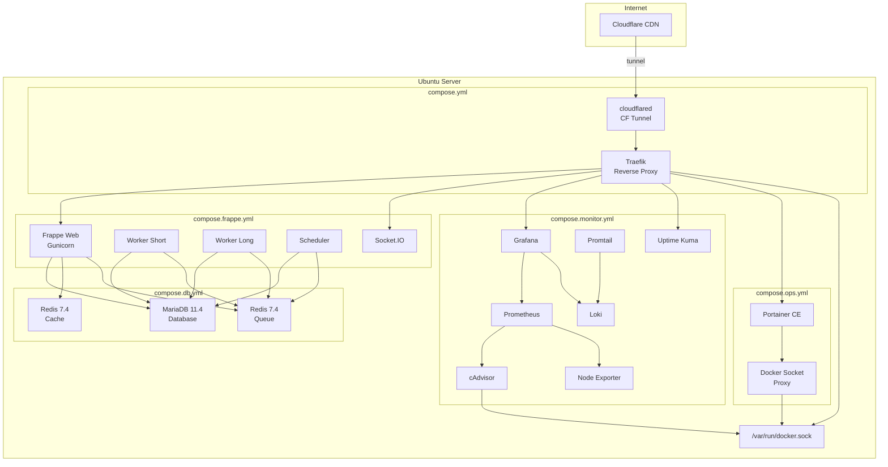

### 5.4 Container Naming Convention

All containers use the prefix defined by `COMPOSE_PROJECT_NAME=mitseri`:

```
mitseri-traefik-1
mitseri-mariadb-1
mitseri-redis-cache-1
mitseri-redis-queue-1
mitseri-frappe-web-1
...
```

### 5.5 Restart Policy

All containers use `restart: unless-stopped` via the `${RESTART_POLICY}` environment variable.

**Rationale:** `unless-stopped` survives host reboots (unlike `on-failure`) but respects manual `docker compose stop` (unlike `always`).

---

## 6. Network Architecture

### 6.1 Network Design

> [!IMPORTANT]
> **Red Team Finding Integrated:** Docker Compose default networks are **prohibited**. Every container MUST be explicitly assigned to one or more named networks. The proxy network is owned by `compose.yml` (core), not `compose.db.yml`.

All networks are defined with `driver: bridge` and explicit subnet allocation.

| Network Name | Defined In | Purpose | Subnet |
|---|---|---|---|
| `proxy` | `compose.yml` | Traefik ↔ web-facing services | 172.20.0.0/24 |
| `backend` | `compose.db.yml` | Application ↔ database/cache | 172.20.1.0/24 |
| `monitoring` | `compose.monitor.yml` | Monitoring ↔ metrics targets | 172.20.2.0/24 |
| `socket-proxy` | `compose.ops.yml` | Portainer ↔ socket proxy (isolated) | 172.20.3.0/24 |

### 6.2 Network Topology

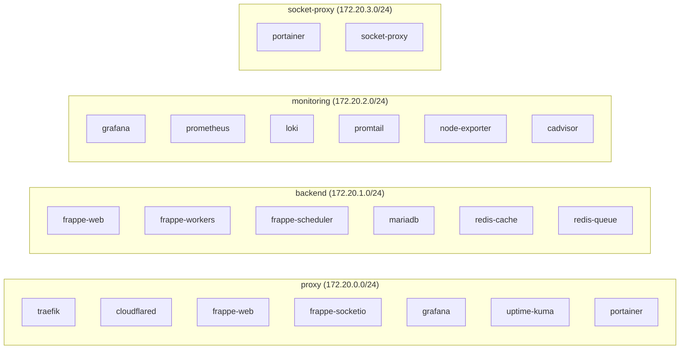

### 6.3 Container-to-Network Assignment Matrix

| Container | `proxy` | `backend` | `monitoring` | `socket-proxy` |
|---|---|---|---|---|
| traefik | ✅ | — | — | — |
| cloudflared | ✅ | — | — | — |
| mariadb | — | ✅ | — | — |
| redis-cache | — | ✅ | — | — |
| redis-queue | — | ✅ | — | — |
| frappe-web | ✅ | ✅ | — | — |
| frappe-socketio | ✅ | ✅ | — | — |
| frappe-worker-short | — | ✅ | — | — |
| frappe-worker-long | — | ✅ | — | — |
| frappe-scheduler | — | ✅ | — | — |
| grafana | ✅ | — | ✅ | — |
| prometheus | — | — | ✅ | — |
| loki | — | — | ✅ | — |
| promtail | — | — | ✅ | — |
| node-exporter | — | — | ✅ | — |
| cadvisor | — | — | ✅ | — |
| uptime-kuma | ✅ | — | — | — |
| portainer | ✅ | — | — | ✅ |
| socket-proxy | — | — | — | ✅ |

### 6.4 Network Security Rules

1. **No container may be on all networks.** Maximum two networks per container.
2. **Database containers** (`mariadb`, `redis-*`) are on `backend` only. They are never exposed to `proxy`.
3. **socket-proxy** is on `socket-proxy` only. It is an airgapped bridge to the Docker socket.
4. **Monitoring agents** (`promtail`, `node-exporter`, `cadvisor`) are on `monitoring` only.
5. **Cross-network communication** is only permitted via containers that are members of both networks (e.g., `frappe-web` bridges `proxy` and `backend`).

### 6.5 External Network Access

| Port | Service | Source | Rationale |
|---|---|---|---|
| None | — | Internet | All traffic enters via Cloudflare Tunnel (no open ports) |
| 22/tcp | SSH | Tailscale + Private RFC1918 | Admin access via UFW rules |
| 41641/udp | Tailscale | Any | WireGuard UDP for mesh VPN |

**Rationale:** Zero open HTTP/HTTPS ports on the host. Cloudflare Tunnel establishes an outbound-only connection to Cloudflare's edge, eliminating the need for port 80/443 in UFW.

---

## 7. Volume Strategy

### 7.1 Volume Types

All persistent data uses **named Docker volumes** managed by Docker Engine. Bind mounts are used only for read-only configuration files and host-level resources.

### 7.2 Named Volumes

| Volume Name | Service | Mount Path | Purpose |
|---|---|---|---|
| `mitseri-mariadb-data` | mariadb | `/var/lib/mysql` | Database storage |
| `mitseri-redis-cache-data` | redis-cache | `/data` | Cache persistence (RDB) |
| `mitseri-redis-queue-data` | redis-queue | `/data` | Queue persistence (AOF) |
| `mitseri-frappe-sites` | frappe-* | `/home/frappe/frappe-bench/sites` | Frappe site data |
| `mitseri-frappe-logs` | frappe-* | `/home/frappe/frappe-bench/logs` | Application logs |
| `mitseri-grafana-data` | grafana | `/var/lib/grafana` | Dashboards, users, preferences |
| `mitseri-prometheus-data` | prometheus | `/prometheus` | Time-series metrics data |
| `mitseri-loki-data` | loki | `/loki` | Log index and chunks |
| `mitseri-uptime-kuma-data` | uptime-kuma | `/app/data` | Monitor configuration |
| `mitseri-portainer-data` | portainer | `/data` | Portainer state |
| `mitseri-traefik-acme` | traefik | `/acme` | TLS certificate storage |

### 7.3 Bind Mounts (Read-Only Configuration)

| Host Path | Container Path | Service | Mode |
|---|---|---|---|
| `./configs/traefik/` | `/etc/traefik/` | traefik | `ro` |
| `./configs/mariadb/` | `/etc/mysql/conf.d/` | mariadb | `ro` |
| `./configs/redis/cache.conf` | `/usr/local/etc/redis/redis.conf` | redis-cache | `ro` |
| `./configs/redis/queue.conf` | `/usr/local/etc/redis/redis.conf` | redis-queue | `ro` |
| `./configs/prometheus/` | `/etc/prometheus/` | prometheus | `ro` |
| `./monitoring/loki/` | `/etc/loki/` | loki | `ro` |
| `./monitoring/promtail/` | `/etc/promtail/` | promtail | `ro` |
| `./monitoring/grafana/provisioning/` | `/etc/grafana/provisioning/` | grafana | `ro` |
| `/var/run/docker.sock` | `/var/run/docker.sock` | socket-proxy | `ro` |
| `/var/run/docker.sock` | `/var/run/docker.sock` | traefik | `ro` |
| `/var/run/docker.sock` | `/var/run/docker.sock` | cadvisor | `ro` |
| `/var/log/` | `/var/log/` | promtail | `ro` |

### 7.4 Volume Backup Matrix

| Volume | Backup Method | Priority | Notes |
|---|---|---|---|
| `mitseri-mariadb-data` | `mariadb-dump` (logical) | **Critical** | Point-in-time consistent dump |
| `mitseri-redis-queue-data` | `BGREWRITEAOF` + copy AOF | **Critical** | Must trigger rewrite before copy |
| `mitseri-redis-cache-data` | Not backed up | Low | Cache is ephemeral by design |
| `mitseri-frappe-sites` | `tar` archive | **Critical** | Contains uploaded files |
| `mitseri-grafana-data` | `tar` archive | Medium | Dashboards can be re-provisioned |
| `mitseri-prometheus-data` | Not backed up | Low | Metrics are ephemeral |
| `mitseri-loki-data` | Not backed up | Low | Logs are ephemeral |
| `mitseri-portainer-data` | Not backed up | Low | Stateless management tool |

---

## 8. Configuration Strategy

### 8.1 Environment Variables

All runtime configuration flows through a single `.env` file at the project root.

**Source of Truth:** `.env` (not committed)  
**Template:** `.env.example` (committed, maintained)

### 8.2 Configuration Flow

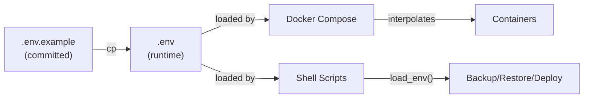

### 8.3 Variable Categories

| Category | Prefix | Example |
|---|---|---|
| General | — | `COMPOSE_PROJECT_NAME`, `TZ`, `DOMAIN` |
| Docker | `DOCKER_` | `DOCKER_LOG_MAX_SIZE` |
| Traefik | `TRAEFIK_` | `TRAEFIK_IMAGE_TAG`, `TRAEFIK_LOG_LEVEL` |
| Cloudflare | `CLOUDFLARE_` | `CLOUDFLARE_TUNNEL_TOKEN` |
| Tailscale | `TAILSCALE_` | `TAILSCALE_AUTHKEY` |
| MariaDB | `MARIADB_` | `MARIADB_ROOT_PASSWORD`, `MARIADB_IMAGE_TAG` |
| Redis | `REDIS_` | `REDIS_IMAGE_TAG`, `REDIS_CACHE_MAXMEMORY` |
| Frappe | `FRAPPE_` | `FRAPPE_VERSION`, `FRAPPE_ADMIN_PASSWORD` |
| Grafana | `GRAFANA_` | `GRAFANA_ADMIN_PASSWORD`, `GRAFANA_IMAGE_TAG` |
| Prometheus | `PROMETHEUS_` | `PROMETHEUS_RETENTION_TIME` |
| Loki | `LOKI_` | `LOKI_RETENTION_PERIOD` |
| Backup | `BACKUP_` | `BACKUP_SCHEDULE`, `BACKUP_ENCRYPTION_KEY` |
| SMTP | `SMTP_` | `SMTP_SERVER`, `SMTP_PASSWORD` |

### 8.4 Secrets Management

| Secret | Storage | Access |
|---|---|---|
| Database passwords | `.env` file (0600 permissions) | Docker Compose env interpolation |
| Cloudflare token | `.env` file | Compose env |
| Tailscale auth key | `.env` file | Bootstrap script |
| Backup encryption key | `.env` file | Backup script |
| GDrive SA credentials | `secrets/` directory (gitignored) | rclone config |
| Traefik dashboard password | `.env` file | Compose env |
| TLS certificates | Docker named volume (`traefik-acme`) | Traefik auto-managed |

**Future Consideration:** Docker Secrets or HashiCorp Vault for secrets rotation. Not in scope for v2.0.

---

## 9. Security Standards

### 9.1 Host-Level Security

| Control | Implementation | Managed By |
|---|---|---|
| SSH Hardening | `PermitRootLogin no`, `MaxAuthTries 3`, `X11Forwarding no` | `02-security-hardening.sh` |
| SSH Access | Key-based auth only (after Phase 2), `AllowUsers deploy` | `02-security-hardening.sh` |
| Firewall | UFW: deny incoming, allow SSH from RFC1918 + Tailscale | `02-security-hardening.sh` |
| Brute-force Protection | fail2ban: 3 retries, 1hr ban | `02-security-hardening.sh` |
| Kernel Hardening | sysctl: SYN cookies, no redirects, no source routing | `02-security-hardening.sh` |
| Auto-Updates | unattended-upgrades: security patches only, no auto-reboot | `02-security-hardening.sh` |
| Log Audit | `/var/log/mitseri/` for all operational logs | `lib/common.sh` |

### 9.2 Docker Security

| Control | Implementation |
|---|---|
| No root containers | All containers run as non-root user (explicit `user:` directive) |
| Docker Socket isolation | Socket Proxy between Docker Engine and management tools |
| No host networking | All containers use bridge networks |
| No privileged containers | `privileged: false` (default) enforced |
| Resource limits | Memory and CPU limits on all containers |
| Image provenance | Official images only, pinned version tags |
| Log driver | `json-file` with max-size 10m, max-file 3 |
| Live restore | `"live-restore": true` in daemon.json |

### 9.3 Network Security

| Control | Implementation |
|---|---|
| Zero open ports | All HTTP traffic via Cloudflare Tunnel (outbound-only) |
| Network segmentation | Four isolated Docker bridge networks |
| Database isolation | MariaDB/Redis on `backend` only, no `proxy` access |
| Admin access | SSH via Tailscale VPN only (post-hardening) |
| TLS everywhere | Cloudflare edge TLS + Traefik internal TLS |

### 9.4 Application Security

| Control | Implementation |
|---|---|
| Frappe admin password | Strong password via `FRAPPE_ADMIN_PASSWORD` |
| Grafana auth | `GRAFANA_ADMIN_PASSWORD`, session management |
| Traefik dashboard | Basic auth via `TRAEFIK_DASHBOARD_PASSWORD` |
| Portainer | Password-protected, behind Traefik + Cloudflare |

---

## 10. Container Hardening Standards

> [!IMPORTANT]
> **Red Team Finding Integrated:** Every container MUST implement the following hardening directives. No exceptions without documented rationale in an Architecture Decision Record.

### 10.1 Mandatory Directives

Every container definition MUST include:

| Directive | Value | Purpose |
|---|---|---|
| `security_opt` | `no-new-privileges:true` | Prevents privilege escalation via setuid/setgid binaries |
| `cap_drop` | `ALL` | Drops all Linux capabilities by default |
| `cap_add` | (only as needed) | Adds back only required capabilities with rationale |
| `user` | `"UID:GID"` | Runs as explicit non-root user |
| `read_only` | `true` (where applicable) | Makes the container root filesystem read-only |
| `tmpfs` | `/tmp`, `/run` (where applicable) | Provides writable temp directories for read-only containers |
| `healthcheck` | (service-specific) | Enables container health monitoring |

### 10.2 Healthcheck Standards

Every container MUST define a healthcheck with these parameters:

| Parameter | Default | Rationale |
|---|---|---|
| `interval` | `30s` | Frequent enough to detect failures quickly |
| `timeout` | `10s` | Allows slow responses without false positives |
| `retries` | `3` | Tolerates transient failures |
| `start_period` | `30s` (service-dependent) | Allows containers time to initialize |

### 10.3 Per-Service Hardening Matrix

| Container | `read_only` | `tmpfs` | `user` | `cap_add` | Notes |
|---|---|---|---|---|---|
| traefik | ✅ | `/tmp` | `65534:65534` | `NET_BIND_SERVICE` | Needs port 80/443 binding |
| cloudflared | ✅ | `/tmp` | `65534:65534` | — | Stateless tunnel client |
| mariadb | ❌ | `/tmp`, `/run/mysqld` | `mysql:mysql` | — | Needs writable data dir |
| redis-cache | ✅ | `/tmp` | `redis:redis` | — | Data in named volume |
| redis-queue | ✅ | `/tmp` | `redis:redis` | — | Data in named volume |
| frappe-web | ❌ | `/tmp` | `frappe:frappe` | — | Needs writable site dir |
| frappe-worker-* | ❌ | `/tmp` | `frappe:frappe` | — | Needs writable site dir |
| frappe-scheduler | ❌ | `/tmp` | `frappe:frappe` | — | Needs writable site dir |
| frappe-socketio | ✅ | `/tmp` | `frappe:frappe` | — | Stateless |
| grafana | ❌ | `/tmp` | `472:0` | — | Grafana official UID |
| prometheus | ✅ | `/tmp` | `65534:65534` | — | Data in named volume |
| loki | ❌ | `/tmp` | `10001:10001` | — | Needs writable data dir |
| promtail | ✅ | `/tmp` | `0:0` | `DAC_READ_SEARCH` | Needs to read host logs |
| node-exporter | ✅ | `/tmp` | `65534:65534` | — | Read-only host metrics |
| cadvisor | ✅ | `/tmp` | `0:0` | — | Needs Docker socket access |
| uptime-kuma | ❌ | `/tmp` | `1000:1000` | — | Needs writable data dir |
| portainer | ❌ | `/tmp` | `0:0` | — | Portainer requires root (vendor limitation) |
| socket-proxy | ✅ | `/tmp` | `0:0` | — | Needs Docker socket access |

> [!NOTE]
> Containers marked `user: 0:0` (cadvisor, promtail, portainer, socket-proxy) have documented reasons for requiring root access. These containers are additionally isolated via network segmentation and `no-new-privileges`.

### 10.4 Healthcheck Definitions

| Container | Test Command | Rationale |
|---|---|---|
| traefik | `traefik healthcheck --ping` | Built-in ping endpoint |
| mariadb | `healthcheck.sh --connect --innodb_initialized` | MariaDB official healthcheck |
| redis-cache | `redis-cli ping` | PONG response confirms service |
| redis-queue | `redis-cli ping` | PONG response confirms service |
| frappe-web | `curl -fs http://localhost:8080/api/method/ping` | Frappe ping endpoint |
| grafana | `curl -fs http://localhost:3000/api/health` | Grafana health API |
| prometheus | `curl -fs http://localhost:9090/-/healthy` | Prometheus health endpoint |
| loki | `curl -fs http://localhost:3100/ready` | Loki readiness endpoint |
| uptime-kuma | `curl -fs http://localhost:3001/` | HTTP response check |
| portainer | `curl -fs http://localhost:9000/api/system/status` | Portainer status API |

---

## 11. Docker Socket Proxy Architecture

### 11.1 Purpose

The Docker Socket Proxy creates a **controlled, read-only gateway** between the Docker Engine's Unix socket and management containers (Portainer). This prevents management tools from having unrestricted access to the Docker API.

> [!IMPORTANT]
> **Red Team Finding Integrated:** Direct Docker socket access from Portainer is **prohibited**. All Portainer-to-Docker communication MUST pass through the socket proxy.

### 11.2 Architecture

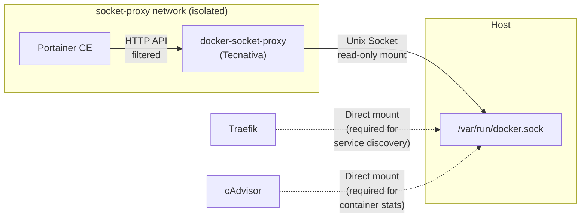

### 11.3 Component Specification

**Docker Socket Proxy (Tecnativa/docker-socket-proxy)**

| Property | Value |
|---|---|
| **Purpose** | Filter and proxy Docker Engine API requests |
| **Responsibilities** | Allow only permitted API endpoints; deny destructive operations |
| **Dependencies** | Docker socket (`/var/run/docker.sock`) |
| **Failure Modes** | Proxy crash → Portainer loses Docker access → manual container management via CLI |
| **Recovery Strategy** | Auto-restart via `unless-stopped`; Portainer reconnects automatically |
| **Security Considerations** | Runs as root (requires socket access); isolated on dedicated network; `no-new-privileges` enforced |

### 11.4 API Access Control

| API Endpoint | Permission | Rationale |
|---|---|---|
| `CONTAINERS` | `1` (read/list) | Portainer needs to list and inspect containers |
| `IMAGES` | `1` (read/list) | Portainer needs to list images |
| `NETWORKS` | `1` (read/list) | Portainer needs to inspect networks |
| `VOLUMES` | `1` (read/list) | Portainer needs to inspect volumes |
| `SERVICES` | `0` (denied) | Swarm services not used |
| `TASKS` | `0` (denied) | Swarm tasks not used |
| `NODES` | `0` (denied) | Swarm nodes not used |
| `BUILD` | `0` (denied) | No image builds from Portainer |
| `COMMIT` | `0` (denied) | No container commits |
| `CONFIGS` | `0` (denied) | No Docker configs |
| `SECRETS` | `0` (denied) | No Docker secrets management via Portainer |
| `EXEC` | `0` (denied) | No container exec from Portainer |
| `POST` | `0` (denied) | Read-only by default |

### 11.5 Containers Requiring Direct Socket Access

| Container | Reason | Mitigation |
|---|---|---|
| Traefik | Real-time Docker service discovery via labels | Read-only mount, `no-new-privileges`, isolated network |
| cAdvisor | Container metrics collection | Read-only mount, `no-new-privileges`, monitoring network only |
| Promtail | Container log file discovery | Mounts `/var/lib/docker/containers/` (not the socket) |

---

## 12. Backup Strategy

### 12.1 Purpose

Ensure all critical data can be recovered to a known-good state within the Recovery Time Objective (RTO) of 4 hours and Recovery Point Objective (RPO) of 24 hours.

### 12.2 Backup Architecture

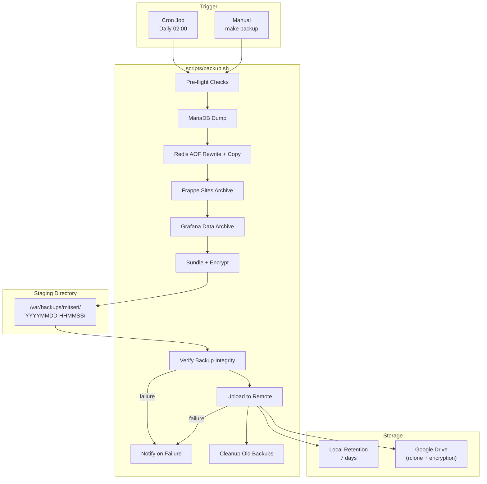

### 12.3 Backup Components

| Component | Method | Details |
|---|---|---|
| MariaDB | `mariadb-dump --single-transaction --routines --triggers --events` | Logical dump, consistent snapshot |
| Redis Queue | `BGREWRITEAOF` → wait → copy `appendonly.aof` | AOF rewrite ensures compacted file |
| Redis Cache | Not backed up | Cache is ephemeral; warms up naturally |
| Frappe Sites | `tar -czf` of sites volume | Includes uploaded files, site configs |
| Grafana | `tar -czf` of grafana data volume | Optional; dashboards are also in git |

> [!IMPORTANT]
> **Red Team Finding Integrated:** Redis backup MUST execute `BGREWRITEAOF` and wait for completion (`INFO persistence` → `aof_rewrite_in_progress:0`) before copying the AOF file. Copying during rewrite produces a corrupt backup.

### 12.4 Staging Directory

> [!IMPORTANT]
> **Red Team Finding Integrated:** Backup staging directory is `/var/backups/mitseri/`, NOT inside the git repository. This prevents large backup files from polluting the repository, avoids `.gitignore` race conditions, and follows the Linux FHS standard.

| Path | Purpose |
|---|---|
| `/var/backups/mitseri/` | Base staging directory |
| `/var/backups/mitseri/YYYYMMDD-HHMMSS/` | Per-run staging directory |
| `/var/backups/mitseri/YYYYMMDD-HHMMSS/mariadb.sql.gz` | Compressed database dump |
| `/var/backups/mitseri/YYYYMMDD-HHMMSS/redis-queue.aof.gz` | Compressed queue AOF |
| `/var/backups/mitseri/YYYYMMDD-HHMMSS/frappe-sites.tar.gz` | Compressed site data |
| `/var/backups/mitseri/YYYYMMDD-HHMMSS/grafana.tar.gz` | Compressed Grafana data |
| `/var/backups/mitseri/YYYYMMDD-HHMMSS/metadata.json` | Backup metadata (versions, checksums) |
| `/var/backups/mitseri/latest` | Symlink to most recent successful backup |

### 12.5 Backup Metadata

Every backup MUST produce a `metadata.json` containing:

```
{
  "timestamp": "2026-07-21T02:00:00+07:00",
  "version": "0.1.0",
  "image_tags": {
    "mariadb": "11.4",
    "redis": "7.4",
    "frappe": "version-15"
  },
  "checksums": {
    "mariadb.sql.gz": "sha256:...",
    "redis-queue.aof.gz": "sha256:...",
    "frappe-sites.tar.gz": "sha256:..."
  },
  "status": "success",
  "duration_seconds": 120
}
```

**Rationale:** The metadata ties each backup to the exact image versions running at backup time. This is critical for the rollback strategy (Section 14) which requires image-backup pairing.

### 12.6 Backup Verification

> [!IMPORTANT]
> **Red Team Finding Integrated:** Every backup MUST be verified before being considered complete.

| Component | Verification Method |
|---|---|
| MariaDB dump | `gzip -t` integrity check + `grep -c "Dump completed"` |
| Redis AOF | `redis-check-aof` on the compressed copy |
| Frappe archive | `tar -tzf` listing check |
| Grafana archive | `tar -tzf` listing check |
| Overall | All checksums in `metadata.json` validated |

### 12.7 Backup Failure Notification

> [!IMPORTANT]
> **Red Team Finding Integrated:** Any backup failure MUST trigger a notification. Silent failures are not acceptable.

| Channel | Method | When |
|---|---|---|
| Email | SMTP via `SMTP_*` env vars | Backup script failure |
| Uptime Kuma | Push monitor heartbeat | Missing heartbeat = backup didn't run |
| Log | `/var/log/mitseri/backup-*.log` | Always |

**Implementation:** The backup script sends a heartbeat to Uptime Kuma's push URL on success. If the heartbeat is not received within the expected interval, Uptime Kuma triggers an alert. On failure, the script sends an email via `curl` to the SMTP endpoint.

### 12.8 Backup Age Health Check

> [!IMPORTANT]
> **Red Team Finding Integrated:** A health check MUST verify that the most recent backup is not older than 26 hours (24h schedule + 2h grace period).

The health check script (`scripts/health-check.sh`) MUST include:

1. Check that `/var/backups/mitseri/latest` symlink exists
2. Check that the symlink target's `metadata.json` has `"status": "success"`
3. Check that the timestamp in `metadata.json` is within 26 hours of current time
4. If any check fails, exit with non-zero status (triggers monitoring alert)

### 12.9 Backup Retention

| Location | Retention | Cleanup |
|---|---|---|
| Local (`/var/backups/mitseri/`) | 7 days | `find ... -mtime +7 -delete` |
| Remote (Google Drive) | 30 days | rclone `--max-age 30d` |

### 12.10 Backup Encryption

All remote backups are encrypted before upload using `BACKUP_ENCRYPTION_KEY`:

- Tool: `gpg --symmetric --cipher-algo AES256` or `openssl enc -aes-256-cbc`
- The encryption key is in `.env` and MUST be stored separately from the backup
- Decryption instructions MUST be documented in the DR runbook

---

## 13. Restore Strategy

### 13.1 Purpose

Restore the platform to a known-good state from a verified backup, with zero risk of data loss during the restore process.

> [!CAUTION]
> **Red Team Finding Integrated:** The restore workflow MUST NEVER drop the production database before verification. All restores go through a temporary database, are verified, then swapped into production.

### 13.2 Restore Workflow

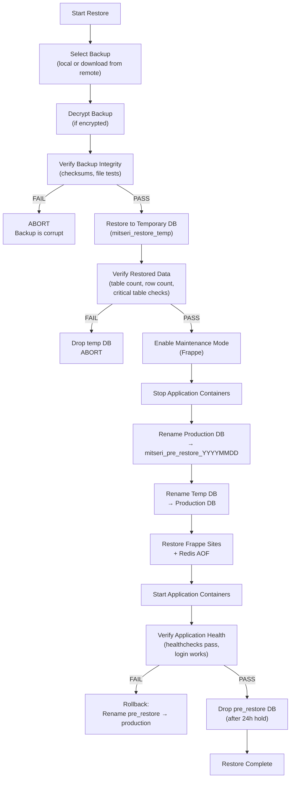

### 13.3 Restore Steps (Detailed)

| Step | Action | Failure Mode | Recovery |
|---|---|---|---|
| 1 | Select and download backup | Network failure | Retry download; use local backup |
| 2 | Decrypt backup | Wrong key | Prompt for correct key; abort |
| 3 | Verify backup integrity | Corrupt archive | Try previous backup |
| 4 | Restore to temp DB | Disk full, SQL errors | Drop temp DB; abort |
| 5 | Verify temp DB data | Missing tables, row count mismatch | Drop temp DB; try previous backup |
| 6 | Enable maintenance mode | Frappe unreachable | Direct DB flag update |
| 7 | Stop application containers | Container hang | `docker compose kill` |
| 8 | Rename production → pre_restore | DB locked | Wait and retry |
| 9 | Rename temp → production | Conflict | Manual intervention |
| 10 | Restore file assets | Disk space | Check space before starting |
| 11 | Start application containers | Container crash | Check logs, rollback if needed |
| 12 | Verify application health | Health check fail | Rollback to pre_restore DB |
| 13 | Cleanup pre_restore DB | — | Manual drop after 24h hold |

### 13.4 Data Verification Checks

The temp database verification (Step 5) MUST include:

1. **Table count:** Count tables in temp DB matches count in production (±5%)
2. **Critical tables exist:** `tabUser`, `tabDocType`, `tabSingles`, `tabDefaultValue`
3. **Row count sanity:** `tabUser` has >0 rows, `tabDocType` has >50 rows
4. **Encoding check:** `SELECT @@character_set_database` = `utf8mb4`
5. **Frappe version check:** `SELECT value FROM tabSingles WHERE doctype='System Settings' AND field='setup_complete'`

---

## 14. Rollback Strategy

### 14.1 Purpose

Revert the platform to a previous known-good state when a deployment or update causes issues.

> [!CAUTION]
> **Red Team Finding Integrated:** Rollback MUST be atomic — container images AND their matching database backup are restored together. Rolling back containers without the matching database state is **prohibited** because schema migrations may have altered the database.

### 14.2 Rollback Principle

```
RULE: Rollback(Image_v2 → Image_v1) REQUIRES Restore(Backup_v1)

An image rollback without the matching database rollback will cause
schema mismatch errors and data corruption.
```

### 14.3 Rollback Workflow

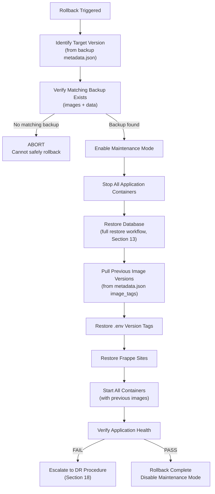

### 14.4 Rollback Prerequisites

Before any rollback can proceed:

1. `metadata.json` from the target backup MUST be available
2. Image tags from `metadata.json.image_tags` MUST still be pullable from Docker Hub
3. Database backup from the matching timestamp MUST be available (local or remote)
4. Sufficient disk space for the restore process

### 14.5 Rollback Scope

| Scope | What Gets Rolled Back | When to Use |
|---|---|---|
| **Full Rollback** | Images + Database + Files | After a failed upgrade with migrations |
| **Config Rollback** | `.env` + configs (git revert) | After a configuration change causes issues |
| **Single Service** | One container's image tag | Only if the service has no DB dependencies |

> [!WARNING]
> **Single Service Rollback** is only safe for stateless services (Traefik, Cloudflared, monitoring agents). Any Frappe-related container rollback MUST be a Full Rollback.

---

## 15. Deployment Flow

### 15.1 Purpose

Define the standard process for deploying changes to the platform, from initial setup to routine updates.

### 15.2 Initial Deployment

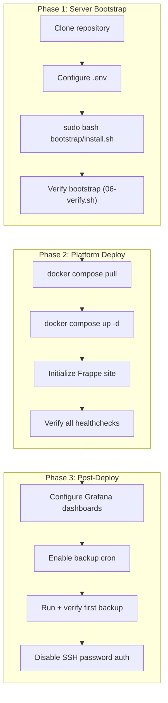

### 15.3 Routine Deployment (Updates)

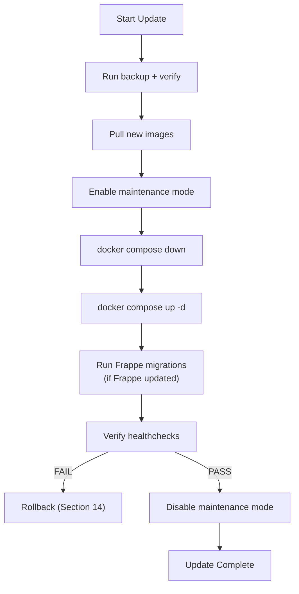

### 15.4 Deployment Checklist

| # | Step | Command | Verify |
|---|---|---|---|
| 1 | Backup | `make backup` | Check `metadata.json` status |
| 2 | Pull images | `make pull` | All images downloaded |
| 3 | Maintenance on | `make maintenance-on` | Site shows maintenance page |
| 4 | Stop services | `make down` | All containers stopped |
| 5 | Start services | `make up` | All containers running |
| 6 | Run migrations | `make migrate` | No errors in output |
| 7 | Verify health | `make health` | All checks pass |
| 8 | Maintenance off | `make maintenance-off` | Site accessible |

---

## 16. Operational Scripts

### 16.1 Purpose

All operational tasks are executed through shell scripts in `scripts/` or via `Makefile` targets. Scripts source the unified `lib/common.sh` library.

### 16.2 Script Inventory

| Script | Purpose | Entry Point |
|---|---|---|
| `scripts/backup.sh` | Full backup orchestration | `make backup` |
| `scripts/restore.sh` | Full restore orchestration | `make restore` |
| `scripts/rollback.sh` | Full rollback orchestration | `make rollback` |
| `scripts/deploy.sh` | Deployment orchestration | `make deploy` |
| `scripts/update.sh` | Image update orchestration | `make update` |
| `scripts/health-check.sh` | System health validation | `make health` |

### 16.3 Makefile Targets

| Target | Description |
|---|---|
| `make up` | Start all containers |
| `make down` | Stop all containers |
| `make pull` | Pull latest pinned images |
| `make restart` | Restart all containers |
| `make logs` | Tail all container logs |
| `make ps` | Show container status |
| `make backup` | Run full backup |
| `make restore` | Interactive restore |
| `make rollback` | Interactive rollback |
| `make health` | Run health checks |
| `make deploy` | Full deployment flow |
| `make update` | Update images + redeploy |
| `make maintenance-on` | Enable Frappe maintenance mode |
| `make maintenance-off` | Disable Frappe maintenance mode |
| `make migrate` | Run Frappe migrations |
| `make shell` | Open shell in Frappe container |
| `make db-shell` | Open MariaDB CLI |

### 16.4 Unified Shell Library

> [!IMPORTANT]
> **Red Team Finding Integrated:** All shell scripts MUST source `lib/common.sh` from the project root. No script may define its own logging, color, or utility functions.

**Library location:** `lib/common.sh` (project root)

**Provided functions:**

| Category | Functions |
|---|---|
| Logging | `log_info`, `log_success`, `log_warn`, `log_error`, `log_dry`, `log_section`, `print_header` |
| Environment | `check_root`, `check_os`, `load_env`, `validate_env` |
| Packages | `check_dependency`, `is_installed`, `install_package` |
| Config | `backup_config`, `write_config` |
| Utility | `retry`, `run_cmd` |
| Error Handling | `trap_error` (ERR trap with stack trace) |

**Script template:**

```
#!/usr/bin/env bash
SCRIPT_DIR="$(cd "$(dirname "${BASH_SOURCE[0]}")" && pwd)"
PROJECT_ROOT="${PROJECT_ROOT:-$(cd "${SCRIPT_DIR}/.." && pwd)}"
source "${PROJECT_ROOT}/lib/common.sh"
```

---

## 17. Monitoring Architecture

### 17.1 Purpose

Provide comprehensive observability across all platform layers: host, container, application, and business metrics. Enable proactive alerting before failures impact users.

### 17.2 Monitoring Stack

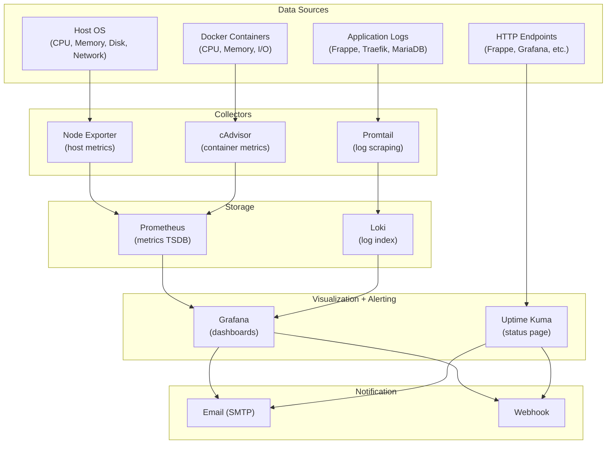

### 17.3 Metrics Collection

| Metric Category | Source | Collector | Storage | Retention |
|---|---|---|---|---|
| Host CPU/Memory/Disk | `/proc`, `/sys` | Node Exporter | Prometheus | 30 days |
| Host I/O | sysstat | Node Exporter textfile | Prometheus | 30 days |
| Container CPU/Memory | Docker API | cAdvisor | Prometheus | 30 days |
| HTTP Request Metrics | Traefik | Traefik built-in | Prometheus | 30 days |
| Application Logs | Container stdout | Promtail | Loki | 30 days |
| Uptime Checks | HTTP probes | Uptime Kuma | SQLite (internal) | 90 days |
| Backup Age | `/var/backups/mitseri/latest` | health-check.sh | Prometheus (pushgateway or textfile) | — |

### 17.4 Promtail Log Scraping

Promtail reads container logs from the Docker json-file log driver:

| Source | Path | Labels |
|---|---|---|
| Docker containers | `/var/lib/docker/containers/*/*.log` | `container_name`, `compose_service` |
| Host syslog | `/var/log/syslog` | `job=syslog` |
| Mitseri operational logs | `/var/log/mitseri/*.log` | `job=mitseri` |

**Rationale for json-file log driver:** Promtail requires JSON-formatted log files. The Docker `local` driver uses a compressed binary format incompatible with Promtail's file-based scraping.

### 17.5 Grafana Dashboards

| Dashboard | Data Source | Purpose |
|---|---|---|
| Host Overview | Prometheus (Node Exporter) | CPU, memory, disk, network, I/O |
| Container Overview | Prometheus (cAdvisor) | Per-container resource usage |
| Traefik | Prometheus (Traefik) | Request rate, latency, errors |
| MariaDB | Prometheus (MariaDB Exporter) | Queries, connections, InnoDB |
| Application Logs | Loki | Frappe error logs, access logs |
| Backup Status | Prometheus | Backup age, last status |

### 17.6 Alerting Rules

| Alert | Condition | Severity | Notification |
|---|---|---|---|
| High CPU | >90% for 5 min | Warning | Email |
| High Memory | >90% for 5 min | Warning | Email |
| Disk Space Low | <10% free | Critical | Email |
| Container Down | Health check failing for 2 min | Critical | Email |
| Backup Age | >26 hours since last backup | Critical | Email |
| Backup Failed | Uptime Kuma heartbeat missed | Critical | Email |
| High Error Rate | >10 5xx errors/min | Warning | Email |
| MariaDB Connections | >80% of max_connections | Warning | Email |
| Redis Memory | >90% of maxmemory | Warning | Email |

### 17.7 Monitoring Subsystem Details

**Prometheus**

| Property | Value |
|---|---|
| **Purpose** | Time-series metrics storage and querying |
| **Responsibilities** | Scrape targets, store metrics, evaluate alert rules |
| **Dependencies** | None (standalone) |
| **Failure Modes** | OOM (data growth), disk full |
| **Recovery Strategy** | Restart; data is ephemeral; retention auto-cleans |
| **Security** | Monitoring network only, no external access |

**Loki**

| Property | Value |
|---|---|
| **Purpose** | Log aggregation and indexing |
| **Responsibilities** | Receive logs from Promtail, index, serve queries |
| **Dependencies** | Promtail for log ingestion |
| **Failure Modes** | OOM, disk full (log volume spike) |
| **Recovery Strategy** | Restart; retention auto-cleans old data |
| **Security** | Monitoring network only, no external access |

**Grafana**

| Property | Value |
|---|---|
| **Purpose** | Visualization dashboards and alerting |
| **Responsibilities** | Query Prometheus/Loki, render dashboards, send alerts |
| **Dependencies** | Prometheus, Loki |
| **Failure Modes** | DB corruption (SQLite), OOM |
| **Recovery Strategy** | Restore from backup; dashboards also provisioned from git |
| **Security** | Behind Traefik + Cloudflare; password-protected |

**Uptime Kuma**

| Property | Value |
|---|---|
| **Purpose** | External uptime monitoring and status page |
| **Responsibilities** | HTTP endpoint probing, push monitor for backups, status page |
| **Dependencies** | None (standalone) |
| **Failure Modes** | SQLite corruption |
| **Recovery Strategy** | Restart; reconfigure monitors manually |
| **Security** | Behind Traefik + Cloudflare; password-protected |

---

## 18. Disaster Recovery

### 18.1 Purpose

Define procedures to recover the entire platform from catastrophic failure (complete server loss).

### 18.2 Recovery Objectives

| Metric | Target | Rationale |
|---|---|---|
| RPO (Recovery Point Objective) | 24 hours | Daily backup schedule |
| RTO (Recovery Time Objective) | 4 hours | Bootstrap (1h) + Deploy (1h) + Restore (1h) + Verify (1h) |

### 18.3 DR Scenarios

| Scenario | Severity | Recovery Procedure |
|---|---|---|
| Single container crash | Low | Auto-restart via `unless-stopped` |
| Multiple containers crash | Medium | `docker compose up -d` |
| Database corruption | High | Full restore from backup (Section 13) |
| Host OS failure | Critical | New server bootstrap + full restore |
| Complete server loss | Critical | New server + restore from remote backup |
| Data center failure | Critical | New server (new provider) + restore from GDrive |

### 18.4 Full DR Procedure

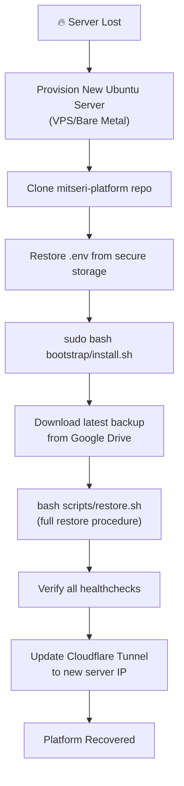

### 18.5 DR Prerequisites

| Requirement | Storage Location | Responsible |
|---|---|---|
| `.env` file (or documentation of values) | Secure offline location (USB, password manager) | SRE Team |
| `BACKUP_ENCRYPTION_KEY` | Separate from backups (password manager) | SRE Team |
| Google Drive SA credentials | Secure offline location | SRE Team |
| Cloudflare Tunnel token | Cloudflare dashboard (regenerate if needed) | SRE Team |
| Tailscale auth key | Tailscale admin console (regenerate) | SRE Team |
| Repository access | GitHub (private repo) | DevOps Team |

### 18.6 DR Testing

DR procedures MUST be tested quarterly:

1. Provision a test server
2. Run full bootstrap
3. Restore from the latest remote backup
4. Verify application functionality
5. Document results and any issues
6. Tear down test server

---

## 19. Update Strategy

### 19.1 Purpose

Define how the platform's components are updated while maintaining stability and recoverability.

### 19.2 Update Categories

| Category | Components | Frequency | Process |
|---|---|---|---|
| Security Patches | Ubuntu OS packages | Automatic (daily) | unattended-upgrades |
| Container Images | All Docker services | Monthly (manual) | Version bump in `.env` → redeploy |
| Frappe Applications | ERPNext, HRMS, Custom | Quarterly (manual) | Version bump → migrate → verify |
| Configuration | Compose files, configs | As needed | Git commit → redeploy |
| Bootstrap Scripts | bootstrap/*.sh | As needed | Git commit (run on next new server) |

### 19.3 Image Update Process

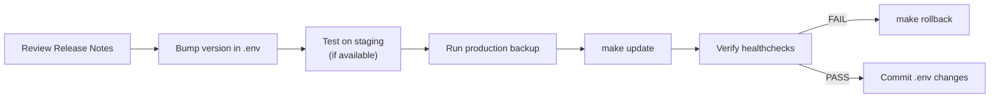

### 19.4 Version Pinning Strategy

| Component | Pin Level | Example | Rationale |
|---|---|---|---|
| MariaDB | Minor | `11.4` | LTS track, patch auto-pulled |
| Redis | Minor | `7.4` | Stable minor, patch auto-pulled |
| Traefik | Minor | `3.4` | Feature-stable minor |
| Grafana | Patch | `11.6.0` | Dashboard compatibility |
| Prometheus | Patch | `v3.4.1` | Query compatibility |
| Loki | Patch | `3.5.0` | Schema compatibility |
| Promtail | Patch | `3.5.0` | Must match Loki version |
| Node Exporter | Patch | `v1.9.1` | Metric name stability |
| cAdvisor | Patch | `v0.52.1` | API stability |
| Cloudflared | Patch | `2025.7.0` | Tunnel protocol compat |

---

## 20. Architecture Decisions

### ADR-001: Single Server, No Kubernetes

| | |
|---|---|
| **Decision** | Deploy on a single Ubuntu server with Docker Compose |
| **Context** | SMB scale (1–500 users), single IT team, cost constraints |
| **Rationale** | Kubernetes adds operational complexity disproportionate to the scale. Docker Compose provides declarative container management sufficient for single-node production. |
| **Consequences** | No horizontal scaling, no automatic failover, single point of failure at the server level |
| **Mitigation** | DR procedure enables recovery to a new server within 4 hours |

### ADR-002: Cloudflare Tunnel Instead of Open Ports

| | |
|---|---|
| **Decision** | Use Cloudflare Tunnel for all inbound HTTP traffic |
| **Context** | Need to expose Frappe, Grafana, Uptime Kuma to the internet |
| **Rationale** | Zero open ports on the server. Cloudflare provides DDoS protection, WAF, and TLS termination at edge. Outbound-only connection model. |
| **Consequences** | Dependency on Cloudflare service availability. Latency added by edge proxy. |
| **Mitigation** | Tailscale provides direct access bypass for admin use |

### ADR-003: Traefik as Reverse Proxy

| | |
|---|---|
| **Decision** | Use Traefik instead of Nginx/Caddy |
| **Context** | Need Docker-native service discovery with automatic routing |
| **Rationale** | Traefik discovers services via Docker labels automatically. No manual nginx config reload needed. Built-in metrics endpoint for Prometheus. |
| **Consequences** | Learning curve for Traefik configuration. Requires Docker socket access. |
| **Mitigation** | Socket access is read-only with `no-new-privileges` |

### ADR-004: Split Compose Files

| | |
|---|---|
| **Decision** | Split Docker Compose into 5 domain-specific files |
| **Context** | Single `docker-compose.yml` becomes unwieldy with 15+ services |
| **Rationale** | Separation of concerns. Each file can be deployed/tested independently. Clear ownership boundaries. |
| **Consequences** | Must use `COMPOSE_FILE` env var or `-f` flags for all commands |
| **Mitigation** | Makefile abstracts the multi-file complexity |

### ADR-005: Docker Socket Proxy for Portainer

| | |
|---|---|
| **Decision** | Proxy Docker socket access through Tecnativa docker-socket-proxy |
| **Context** | Portainer requires Docker API access for container management |
| **Rationale** | Direct socket access grants full root-equivalent control over the host. The proxy filters API calls, denying destructive operations. |
| **Consequences** | Additional container to manage. Portainer functionality limited to read operations. |
| **Mitigation** | CLI access via SSH remains available for write operations |

### ADR-006: json-file Log Driver

| | |
|---|---|
| **Decision** | Use Docker's `json-file` log driver instead of `local` |
| **Context** | Promtail needs to scrape container logs from the filesystem |
| **Rationale** | The `local` driver uses compressed binary format incompatible with Promtail's file-based log scraping. `json-file` produces human-readable JSON that Promtail can parse. |
| **Consequences** | Slightly higher disk I/O compared to `local` driver |
| **Mitigation** | Log rotation via `max-size: 10m, max-file: 3` limits total log size to ~30MB per container |

### ADR-007: Staging Directory Outside Repository

| | |
|---|---|
| **Decision** | Use `/var/backups/mitseri/` for backup staging |
| **Context** | Backups need a staging area before remote upload |
| **Rationale** | Follows Linux FHS standard. Prevents large binary files from polluting the git repository. Avoids `.gitignore` complexity. Independent of repository location. |
| **Consequences** | Requires directory creation during bootstrap |
| **Mitigation** | Bootstrap script creates the directory with correct permissions |

### ADR-008: Atomic Rollback (Image + Database)

| | |
|---|---|
| **Decision** | Rollback always restores both container images AND their matching database backup |
| **Context** | Frappe migrations alter database schema on upgrade |
| **Rationale** | Rolling back container images without matching database state causes schema mismatch. The new image expects the old schema, but the database has the new schema from the migration. |
| **Consequences** | Rollback is a heavier operation (full restore) |
| **Mitigation** | `metadata.json` in each backup ties image versions to data snapshots, making the pairing reliable |

### ADR-009: Explicit Network Assignment

| | |
|---|---|
| **Decision** | Prohibit Docker Compose default networks; every container explicitly assigned |
| **Context** | Default networks allow all containers in a Compose file to communicate freely |
| **Rationale** | Explicit assignment enforces network segmentation. Database containers cannot be reached from proxy network. Monitoring traffic is isolated. |
| **Consequences** | More verbose Compose files |
| **Mitigation** | Network assignment matrix (Section 6.3) provides a clear reference |

### ADR-010: Safe Restore via Temporary Database

| | |
|---|---|
| **Decision** | Restore into a temporary database, verify, then swap |
| **Context** | Dropping production database before verifying the backup is catastrophic if the backup is corrupt |
| **Rationale** | The temp database approach ensures production data is never destroyed until the replacement is verified. |
| **Consequences** | Requires sufficient disk space for two databases simultaneously. Restore takes longer. |
| **Mitigation** | Health check verifies disk space before starting restore |

### ADR-011: Proxy Network Ownership

| | |
|---|---|
| **Decision** | The `proxy` network is defined in `compose.yml` (core), not `compose.db.yml` |
| **Context** | The proxy network is used by Traefik, Frappe, Grafana, Uptime Kuma, and Portainer — spanning multiple Compose files |
| **Rationale** | The core infrastructure file (`compose.yml`) is always loaded first and is the natural owner of cross-cutting infrastructure like the proxy network. Database services don't need proxy access. |
| **Consequences** | `compose.db.yml` references the proxy network as `external: true` if needed (it shouldn't) |
| **Mitigation** | Database containers are on `backend` network only — no proxy network reference needed |

---

## 21. Known Limitations

### 21.1 Single Point of Failure

| Component | Impact | Mitigation |
|---|---|---|
| Server hardware | Complete outage | DR procedure: new server + restore (RTO 4h) |
| Docker Engine | All containers down | `live-restore: true` survives daemon restarts |
| MariaDB | Application unavailable | Backup/restore; no automatic failover |
| Cloudflare | External access lost | Tailscale provides admin bypass; Cloudflare has 99.99% SLA |
| Internet connectivity | External access lost | Local network access via Tailscale |

### 21.2 Scalability Limits

| Constraint | Limit | Workaround |
|---|---|---|
| Vertical scaling | Server hardware capacity | Upgrade server specs |
| Horizontal scaling | Not supported (single node) | Migrate to Kubernetes (out of scope) |
| Concurrent users | ~500 (Frappe limitation) | Additional Frappe workers, server upgrade |
| Database size | Disk capacity | Larger disk, archival strategy |

### 21.3 Operational Constraints

| Constraint | Description | Impact |
|---|---|---|
| Zero-downtime deploys | Not supported | Brief downtime during `docker compose down/up` |
| Blue-green deployment | Not supported | Single-server limitation |
| Automatic failover | Not supported | Manual DR procedure required |
| Multi-region | Not supported | Single server, single location |

### 21.4 Security Constraints

| Constraint | Description | Mitigation |
|---|---|---|
| Portainer runs as root | Vendor limitation | Isolated via socket proxy + dedicated network |
| cAdvisor runs as root | Requires Docker socket | Monitoring network only, `no-new-privileges` |
| Promtail runs as root | Needs to read host logs | Monitoring network only, `no-new-privileges` |
| Secrets in `.env` file | Not encrypted at rest | File permissions 0600; future: Docker Secrets or Vault |

---

## 22. Future Expansion

### 22.1 Planned Enhancements (Post v2.0)

| Enhancement | Priority | Complexity | Description |
|---|---|---|---|
| Docker Secrets | High | Medium | Migrate secrets from `.env` to Docker Secrets |
| WAF Rules | High | Low | Cloudflare WAF rule configuration |
| Grafana Alerting via Telegram/Slack | Medium | Low | Additional notification channels |
| MariaDB Read Replica | Medium | High | Read scaling for reporting workloads |
| Automated DR Testing | Medium | Medium | Scheduled DR test on test server |
| Container Image Scanning | Medium | Low | Trivy or Grype for vulnerability scanning |
| Centralized Secrets (Vault) | Low | High | HashiCorp Vault for secrets management |
| Multi-server Support | Low | Very High | Requires significant architecture redesign |
| CI/CD Pipeline | Low | Medium | Automated testing and deployment |

### 22.2 Expansion Rules

Any future expansion MUST:

1. Submit an Architecture Change Request (ACR) before implementation
2. Not violate any existing design principle (Section 2)
3. Include updated architecture diagrams
4. Include rollback procedure for the change
5. Be tested on a staging environment first
6. Update this document after approval

---

## Appendix A: Revision History

| Version | Date | Author | Description |
|---|---|---|---|
| 1.0 | 2026-07-20 | Architecture Team | Initial architecture |
| 2.0 | 2026-07-21 | Architecture Team | Integrated Red Team findings; architecture freeze |

## Appendix B: Red Team Findings Cross-Reference

| Finding | Section | Status |
|---|---|---|
| Container hardening (no-new-privileges, cap_drop, read_only, tmpfs, user, healthcheck) | [10. Container Hardening](#10-container-hardening-standards) | ✅ Integrated |
| Docker Socket Proxy for Portainer | [11. Docker Socket Proxy](#11-docker-socket-proxy-architecture) | ✅ Integrated |
| Remove default network usage | [6.1 Network Design](#61-network-design) | ✅ Integrated |
| Explicit container-to-network assignment | [6.3 Container-to-Network Matrix](#63-container-to-network-assignment-matrix) | ✅ Integrated |
| Proxy network ownership in compose.yml | [6.1 Network Design](#61-network-design), [ADR-011](#adr-011-proxy-network-ownership) | ✅ Integrated |
| Unified lib/common.sh | [4.1 Key Structural Decisions](#41-key-structural-decisions), [16.4 Unified Shell Library](#164-unified-shell-library) | ✅ Integrated |
| Backup staging /var/backups/mitseri | [12.4 Staging Directory](#124-staging-directory), [ADR-007](#adr-007-staging-directory-outside-repository) | ✅ Integrated |
| Restore: never drop prod DB before verify | [13. Restore Strategy](#13-restore-strategy), [ADR-010](#adr-010-safe-restore-via-temporary-database) | ✅ Integrated |
| Rollback: image + database atomic | [14. Rollback Strategy](#14-rollback-strategy), [ADR-008](#adr-008-atomic-rollback-image--database) | ✅ Integrated |
| Redis BGREWRITEAOF before backup | [12.3 Backup Components](#123-backup-components) | ✅ Integrated |
| Backup verification documented | [12.6 Backup Verification](#126-backup-verification) | ✅ Integrated |
| Backup failure notification | [12.7 Backup Failure Notification](#127-backup-failure-notification) | ✅ Integrated |
| Backup age health check | [12.8 Backup Age Health Check](#128-backup-age-health-check) | ✅ Integrated |
| sysstat dependency | [3.6 Host Dependencies](#36-host-dependencies) | ✅ Integrated |
| .gitignore JSON fix | [4.2 .gitignore Fix](#42-gitignore-fix) | ✅ Integrated |

---

> **END OF ARCHITECTURE DOCUMENT**
>
> This document is frozen as of 2026-07-21.
> Implementation may begin.
