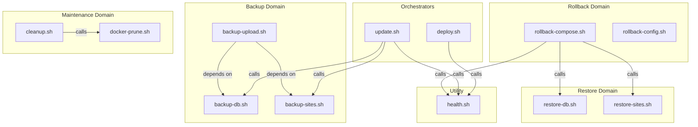

# BLUEPRINT IMPLEMENTATION — Milestone 2 Scripts

> **Status:** Design Document — Pending Approval  
> **Version:** 1.0  
> **Date:** 2026-07-21  
> **Architecture Reference:** [ARCHITECTURE-v2.0-FINAL.md](file:///d:/Project/mitseri-platform/docs/ARCHITECTURE-v2.0-FINAL.md)  
> **Classification:** Implementation Blueprint — No Code

---

> [!IMPORTANT]
> This document defines the **complete implementation design** for every operational script in Milestone 2.  
> No script may be coded until this blueprint is approved.  
> Every script MUST source `lib/common.sh` and follow the patterns defined here.

---

## Table of Contents

1. [Global Standards](#global-standards)
2. [Script Dependency Graph](#script-dependency-graph)
3. [deploy.sh](#script-01-deploysh)
4. [update.sh](#script-02-updatesh)
5. [health.sh](#script-03-healthsh)
6. [backup-db.sh](#script-04-backup-dbsh)
7. [backup-sites.sh](#script-05-backup-sitessh)
8. [backup-upload.sh](#script-06-backup-uploadsh)
9. [restore-db.sh](#script-07-restore-dbsh)
10. [restore-sites.sh](#script-08-restore-sitessh)
11. [rollback-compose.sh](#script-09-rollback-composesh)
12. [rollback-config.sh](#script-10-rollback-configsh)
13. [docker-prune.sh](#script-11-docker-prunesh)
14. [cleanup.sh](#script-12-cleanupsh)

---

## Global Standards

These standards apply to **every script** in this blueprint.

### File Header

Every script MUST begin with:

```
#!/usr/bin/env bash
SCRIPT_DIR="$(cd "$(dirname "${BASH_SOURCE[0]}")" && pwd)"
PROJECT_ROOT="${PROJECT_ROOT:-$(cd "${SCRIPT_DIR}/.." && pwd)}"
source "${PROJECT_ROOT}/lib/common.sh"
```

### Sourced Library

All scripts source `lib/common.sh` which provides:

| Function | Purpose |
|---|---|
| `log_info`, `log_success`, `log_warn`, `log_error` | Structured logging to stdout + log file |
| `log_section`, `print_header` | Visual section delimiters |
| `check_root` | Abort if not running as root |
| `load_env` | Safe `.env` parsing without `eval` |
| `validate_env` | Assert required env vars are set and not `CHANGE_ME` |
| `check_dependency` | Assert a binary exists in `$PATH` |
| `retry` | Retry with exponential backoff |
| `run_cmd` | Dry-run–aware command execution |
| `trap_error` | ERR trap with stack trace |

### Bash Strict Mode

Enforced by `lib/common.sh`: `set -Eeuo pipefail`

### Logging Convention

| Destination | Format | Path |
|---|---|---|
| stdout | `[LEVEL] message` with ANSI colors | Terminal |
| Log file | `[timestamp] [LEVEL] message` plain text | `/var/log/mitseri/<script>-YYYYMMDD-HHMMSS.log` |

### Exit Code Convention

| Code | Meaning |
|---|---|
| `0` | Success |
| `1` | General error (validation, runtime failure) |
| `2` | Usage error (wrong arguments) |
| `3` | Dependency missing |
| `4` | Pre-condition not met (disk space, running containers) |
| `5` | Verification failed (post-action check) |

### Dry-Run Support

Every script that mutates state MUST support `--dry-run` (or `DRY_RUN=true` env). In dry-run mode, the script logs what it **would** do without executing.

### Compose File Loading

All Docker Compose commands MUST use the `COMPOSE_FILE` env var or explicit `-f` flags as defined in `.env`:

```
COMPOSE_FILE=docker/compose.yml:docker/compose.db.yml:docker/compose.frappe.yml:docker/compose.monitor.yml:docker/compose.ops.yml
```

### Constants

| Constant | Value | Used By |
|---|---|---|
| `BACKUP_BASE_DIR` | `/var/backups/mitseri` | backup-*, restore-*, rollback-*, cleanup |
| `COMPOSE_DIR` | `${PROJECT_ROOT}/docker` | deploy, update, rollback-compose |
| `BACKUP_RETENTION_DAYS` | `${BACKUP_LOCAL_RETENTION_DAYS:-7}` | cleanup |

---

## Script Dependency Graph



---

## Script 01: deploy.sh

### 1. Tujuan

Orchestrate the full initial deployment of the Mitseri Platform on a freshly bootstrapped server, or re-deploy when all containers need to be recreated.

### 2. Kapan Dijalankan

- **Initial deployment** — After `bootstrap/install.sh` completes successfully
- **Re-deployment** — When Compose files or major configs change
- **Disaster recovery** — After restoring to a new server
- Entry point: `make deploy`

### 3. Dependency

| Dependency | Type | Check Method |
|---|---|---|
| `docker` | Binary | `check_dependency docker` |
| `docker compose` | Plugin | `docker compose version` |
| `.env` | File | `load_env` + `validate_env` |
| `docker/compose.yml` | File | File existence check |
| `docker/compose.db.yml` | File | File existence check |
| `docker/compose.frappe.yml` | File | File existence check |
| `docker/compose.monitor.yml` | File | File existence check |
| `docker/compose.ops.yml` | File | File existence check |
| `lib/common.sh` | Library | Sourced at top |
| Bootstrap completed | State | Docker service running |

### 4. Input

| Input | Source | Required | Default |
|---|---|---|---|
| `--dry-run` | CLI flag | No | `false` |
| `--skip-pull` | CLI flag | No | `false` |
| `--skip-health` | CLI flag | No | `false` |
| `.env` | File | Yes | — |

### 5. Output

| Output | Description |
|---|---|
| Running containers | All platform containers started and healthy |
| Log file | `/var/log/mitseri/deploy-YYYYMMDD-HHMMSS.log` |
| stdout | Step-by-step progress with success/failure indicators |

### 6. Exit Code

| Code | Meaning |
|---|---|
| `0` | All containers deployed and healthy |
| `1` | Runtime error during deployment |
| `2` | Usage error |
| `3` | Missing dependency (Docker not installed) |
| `4` | Pre-condition failed (`.env` not configured) |
| `5` | Post-deployment health check failed |

### 7. Validasi Sebelum Berjalan

| # | Check | Failure Action |
|---|---|---|
| 1 | Running as root or deploy user with docker group | Exit 1 |
| 2 | `.env` exists and all critical vars set | Exit 4 |
| 3 | Docker daemon is running | Exit 3 |
| 4 | All Compose files exist | Exit 4 |
| 5 | `docker compose config --quiet` passes (YAML valid) | Exit 4 |
| 6 | Minimum disk space available (10 GB free) | Exit 4 |
| 7 | No port conflicts on host (22, 41641 only) | Warn only |

### 8. Flow Langkah Demi Langkah

| Step | Action | Detail |
|---|---|---|
| 1 | Parse arguments | `--dry-run`, `--skip-pull`, `--skip-health` |
| 2 | Source `lib/common.sh` | Strict mode, logging, colors |
| 3 | Load `.env` | `load_env "${PROJECT_ROOT}/.env"` |
| 4 | Validate environment | `validate_env COMPOSE_PROJECT_NAME DOMAIN MARIADB_ROOT_PASSWORD ...` |
| 5 | Pre-flight checks | Docker running, Compose valid, disk space |
| 6 | Print deployment plan | List all Compose files and image tags to be deployed |
| 7 | Pull images | `docker compose pull` (skip if `--skip-pull`) |
| 8 | Create networks | Handled by `docker compose up`, but verify explicit networks exist after |
| 9 | Start containers | `docker compose up -d --remove-orphans` |
| 10 | Wait for healthy | Loop: check `docker compose ps` for all services `healthy`; max 180s timeout |
| 11 | Run health checks | Call `scripts/health.sh` (skip if `--skip-health`) |
| 12 | Print summary | Container status, access URLs, next steps |

### 9. Error Handling

| Error | Handler |
|---|---|
| `docker compose pull` fails | Log error, suggest checking network/image tags; exit 1 |
| `docker compose up` fails | Log error, run `docker compose logs --tail=50`; exit 1 |
| Health check timeout | Log which containers are unhealthy, show logs for those containers; exit 5 |
| Any ERR trap | Stack trace via `trap_error`; exit with original code |

### 10. Recovery Jika Gagal

| Failure Point | Recovery |
|---|---|
| Pull fails | Fix network/credentials; re-run `make deploy` |
| Containers won't start | Check `docker compose logs <service>`; fix config; `make down && make deploy` |
| Health check fails | Inspect unhealthy container logs; fix; `make restart` |
| Partial start | `docker compose down --remove-orphans && make deploy` |

### 11. Logging

| Log Event | Level |
|---|---|
| Script start + parameters | INFO |
| `.env` loaded | SUCCESS |
| Each validation check result | INFO / SUCCESS / ERROR |
| Image pull start/end | INFO / SUCCESS |
| Container start | INFO |
| Per-container health status | SUCCESS / WARN |
| Total deploy duration | INFO |
| Final status | SUCCESS / ERROR |

### 12. File Yang Dibaca

| File | Purpose |
|---|---|
| `.env` | All configuration |
| `docker/compose.yml` | Core compose |
| `docker/compose.db.yml` | Database compose |
| `docker/compose.frappe.yml` | Frappe compose |
| `docker/compose.monitor.yml` | Monitoring compose |
| `docker/compose.ops.yml` | Operations compose |

### 13. File Yang Dihasilkan

| File | Purpose |
|---|---|
| `/var/log/mitseri/deploy-YYYYMMDD-HHMMSS.log` | Full deployment log |

### 14. Security Consideration

| Concern | Mitigation |
|---|---|
| `.env` contains secrets | Loaded via safe parser, never echoed to log |
| Passwords in environment | Compose interpolation only, not exported to child processes |
| Docker socket | Script doesn't interact with socket directly; uses `docker compose` CLI |
| Root execution | Preferred via `deploy` user in docker group; `check_root` is optional here |

### 15. Future Enhancement

- Add `--profile` flag to deploy specific profiles (e.g., `monitoring` only)
- Add pre-deploy backup trigger
- Add Slack/Telegram notification on deploy success/failure
- Add deploy versioning (tag deployments in git)

---

## Script 02: update.sh

### 1. Tujuan

Safely update container images to new pinned versions defined in `.env`, including pre-update backup, image pull, rolling restart, migration execution, and post-update verification.

### 2. Kapan Dijalankan

- **Monthly** — Routine container image updates
- **Quarterly** — Frappe version upgrades (includes migrations)
- **Emergency** — Security patch for specific image
- Entry point: `make update`

### 3. Dependency

| Dependency | Type | Check Method |
|---|---|---|
| `docker` | Binary | `check_dependency docker` |
| `docker compose` | Plugin | `docker compose version` |
| `scripts/backup-db.sh` | Script | File existence |
| `scripts/backup-sites.sh` | Script | File existence |
| `scripts/health.sh` | Script | File existence |
| `.env` | File | `load_env` |
| Running containers | State | `docker compose ps` shows services |
| `/var/backups/mitseri/` | Directory | Directory exists |

### 4. Input

| Input | Source | Required | Default |
|---|---|---|---|
| `--dry-run` | CLI flag | No | `false` |
| `--skip-backup` | CLI flag | No | `false` |
| `--skip-migrate` | CLI flag | No | `false` |
| `--service <name>` | CLI flag | No | All services |
| `.env` | File | Yes | — |

### 5. Output

| Output | Description |
|---|---|
| Updated containers | Containers running with new image versions |
| Pre-update backup | Complete backup in `/var/backups/mitseri/` |
| `metadata.json` | Updated metadata with new image tags |
| Log file | `/var/log/mitseri/update-YYYYMMDD-HHMMSS.log` |

### 6. Exit Code

| Code | Meaning |
|---|---|
| `0` | Update completed, health checks pass |
| `1` | Runtime error |
| `2` | Usage error |
| `3` | Missing dependency |
| `4` | Pre-update backup failed (ABORT — nothing changed) |
| `5` | Post-update health check failed (ROLLBACK needed) |

### 7. Validasi Sebelum Berjalan

| # | Check | Failure Action |
|---|---|---|
| 1 | Docker daemon running | Exit 3 |
| 2 | `.env` valid | Exit 4 |
| 3 | Current containers are running | Exit 4 |
| 4 | Disk space ≥ 5 GB free | Exit 4 |
| 5 | `/var/backups/mitseri/` writable | Exit 4 |
| 6 | New image tags differ from current (at least one change) | Warn and confirm |

### 8. Flow Langkah Demi Langkah

| Step | Action | Detail |
|---|---|---|
| 1 | Parse arguments | `--dry-run`, `--skip-backup`, `--skip-migrate`, `--service` |
| 2 | Load environment | `load_env`, `validate_env` |
| 3 | Record current state | Capture current image digests: `docker compose images --format json` |
| 4 | Compare versions | Show diff table: current tag vs new tag from `.env` |
| 5 | Confirm with operator | Interactive confirmation unless `--yes` flag (non-interactive aborts) |
| 6 | **Pre-update backup** | Run `scripts/backup-db.sh` + `scripts/backup-sites.sh`; if either fails → exit 4, nothing changed |
| 7 | Record backup path | Store path to this backup in a variable for potential rollback |
| 8 | Pull new images | `docker compose pull` |
| 9 | Enable maintenance mode | `docker compose exec frappe-web bench set-maintenance-mode on` |
| 10 | Stop application containers | `docker compose stop` (graceful) |
| 11 | Start with new images | `docker compose up -d --remove-orphans` |
| 12 | Wait for healthy | Loop health check, max 180s |
| 13 | Run Frappe migrations | `docker compose exec frappe-web bench --site all migrate` (skip if `--skip-migrate`) |
| 14 | Run health checks | Call `scripts/health.sh` |
| 15 | Disable maintenance mode | `docker compose exec frappe-web bench set-maintenance-mode off` |
| 16 | Print summary | Old vs new versions, total downtime duration |

### 9. Error Handling

| Error | Handler |
|---|---|
| Backup fails (step 6) | Exit 4 — **nothing has changed**, safe to retry |
| Pull fails (step 8) | Exit 1 — containers still running old version, nothing changed |
| Containers won't start (step 11) | Log error, print rollback instructions; exit 1 |
| Migration fails (step 13) | Log error; print: `make rollback` to revert; exit 5 |
| Health check fails (step 14) | Log error; print: `make rollback` to revert; exit 5 |

### 10. Recovery Jika Gagal

| Failure Point | Recovery |
|---|---|
| Before step 9 | Nothing changed; fix issue and retry |
| Steps 9–13 | Run `make rollback` → restores pre-update backup + images |
| Step 14 (health fail) | Run `make rollback` → full atomic rollback |

### 11. Logging

| Log Event | Level |
|---|---|
| Script start + target versions | INFO |
| Current vs new image tag table | INFO |
| Backup start/success/failure | INFO / SUCCESS / ERROR |
| Each phase (pull, stop, start, migrate) | INFO |
| Per-container health result | SUCCESS / WARN / ERROR |
| Maintenance mode toggle | INFO |
| Total update duration + downtime duration | INFO |

### 12. File Yang Dibaca

| File | Purpose |
|---|---|
| `.env` | New image tags, config |
| `docker/compose.*.yml` | Compose definitions |
| `/var/backups/mitseri/latest/metadata.json` | Previous backup state |

### 13. File Yang Dihasilkan

| File | Purpose |
|---|---|
| `/var/backups/mitseri/YYYYMMDD-HHMMSS/` | Pre-update backup |
| `/var/log/mitseri/update-YYYYMMDD-HHMMSS.log` | Update log |

### 14. Security Consideration

| Concern | Mitigation |
|---|---|
| Secrets in `.env` | Safe parser, never logged |
| Image provenance | Only official images via pinned tags |
| Maintenance mode bypass | Maintenance mode set via Frappe bench, not just Traefik |
| Rollback key exposure | Backup encryption key needed for rollback; verify it's accessible |

### 15. Future Enhancement

- Canary deployment: update one worker first, verify, then update all
- Automatic rollback on health check failure
- Changelog generation from image diff
- Notification to Slack/Telegram on update complete

---

## Script 03: health.sh

### 1. Tujuan

Perform comprehensive health validation of the entire platform: containers, services, database, backup freshness, disk space, and system resources. Produce a machine-readable exit code and human-readable report.

### 2. Kapan Dijalankan

- **After every deploy/update** — Called by `deploy.sh` and `update.sh`
- **On-demand** — `make health`
- **Cron** — Can be scheduled for periodic health monitoring
- **Monitoring integration** — Exit code consumed by Prometheus textfile collector

### 3. Dependency

| Dependency | Type | Check Method |
|---|---|---|
| `docker` | Binary | `check_dependency docker` |
| `docker compose` | Plugin | `docker compose version` |
| `curl` | Binary | `check_dependency curl` |
| `jq` | Binary | `check_dependency jq` |
| `.env` | File | `load_env` |

### 4. Input

| Input | Source | Required | Default |
|---|---|---|---|
| `--quiet` | CLI flag | No | `false` (full report) |
| `--json` | CLI flag | No | `false` (human-readable) |
| `--check <name>` | CLI flag | No | All checks |
| `.env` | File | Yes | — |

### 5. Output

| Output | Description |
|---|---|
| stdout | Health report (human-readable or JSON) |
| Exit code | 0 = all pass, 5 = one or more critical failures |
| Log file | `/var/log/mitseri/health-YYYYMMDD-HHMMSS.log` |

### 6. Exit Code

| Code | Meaning |
|---|---|
| `0` | All checks pass |
| `1` | Runtime error in health script itself |
| `5` | One or more critical health checks failed |

### 7. Validasi Sebelum Berjalan

| # | Check | Failure Action |
|---|---|---|
| 1 | Docker daemon running | Exit 3 |
| 2 | `.env` exists | Exit 4 |
| 3 | `jq` available | Exit 3 |

### 8. Flow Langkah Demi Langkah

| Step | Action | Detail |
|---|---|---|
| 1 | Parse arguments | `--quiet`, `--json`, `--check` |
| 2 | Load environment | `load_env` |
| 3 | Initialize result counters | `pass=0, warn=0, fail=0` |
| 4 | **Check: Container Status** | For each expected service: verify container is running AND health status = `healthy` |
| 5 | **Check: MariaDB Connectivity** | `docker compose exec mariadb mariadb -u root -p"${MARIADB_ROOT_PASSWORD}" -e "SELECT 1"` |
| 6 | **Check: Redis Cache Ping** | `docker compose exec redis-cache redis-cli ping` → expect `PONG` |
| 7 | **Check: Redis Queue Ping** | `docker compose exec redis-queue redis-cli ping` → expect `PONG` |
| 8 | **Check: Frappe Web** | `curl -fs http://localhost:${FRAPPE_HTTP_PORT}/api/method/ping` |
| 9 | **Check: Traefik** | `curl -fs http://localhost:8080/ping` (Traefik ping endpoint) |
| 10 | **Check: Grafana** | `curl -fs http://localhost:${GRAFANA_HTTP_PORT}/api/health` |
| 11 | **Check: Disk Space** | Root partition free ≥ 10%; `/var/backups/mitseri/` free ≥ 5 GB |
| 12 | **Check: Memory** | Available memory ≥ 10% of total |
| 13 | **Check: Backup Age** | `/var/backups/mitseri/latest` symlink → `metadata.json` → timestamp within 26 hours |
| 14 | **Check: Backup Integrity** | `metadata.json` → `"status": "success"` |
| 15 | **Check: Docker Disk** | `docker system df` → warn if reclaimable > 5 GB |
| 16 | Aggregate results | Count pass/warn/fail |
| 17 | Print report | Table format or JSON based on flags |
| 18 | Exit with code | 0 if all critical pass; 5 if any critical fail |

### 9. Error Handling

| Error | Handler |
|---|---|
| Container not found | Mark as FAIL, continue to next check |
| `docker compose exec` timeout | Mark as FAIL with timeout note |
| `curl` timeout | Mark as FAIL, log endpoint unreachable |
| Backup `latest` symlink missing | Mark backup checks as FAIL |
| `jq` parse error on metadata.json | Mark as FAIL, log malformed JSON |

### 10. Recovery Jika Gagal

This script is **read-only** — it does not modify state. Recovery actions are printed as recommendations:

| Check Failed | Recommended Action |
|---|---|
| Container unhealthy | `docker compose restart <service>` |
| DB connectivity | Check MariaDB logs: `docker compose logs mariadb` |
| Backup age | Run `make backup` immediately |
| Disk space | Run `make cleanup` or `make docker-prune` |
| Memory | Investigate high-memory containers via `docker stats` |

### 11. Logging

| Log Event | Level |
|---|---|
| Each check name + result (PASS/WARN/FAIL) | SUCCESS / WARN / ERROR |
| Summary totals | INFO |
| Recommended actions for failures | WARN |

### 12. File Yang Dibaca

| File | Purpose |
|---|---|
| `.env` | Ports, passwords for connectivity checks |
| `/var/backups/mitseri/latest/metadata.json` | Backup age and status |

### 13. File Yang Dihasilkan

| File | Purpose |
|---|---|
| `/var/log/mitseri/health-YYYYMMDD-HHMMSS.log` | Health check log |
| stdout | Health report (optionally JSON for monitoring) |

### 14. Security Consideration

| Concern | Mitigation |
|---|---|
| DB password in exec command | Password from `.env`, not logged; uses `exec` inside container network |
| Health endpoint exposure | All checked via `localhost`, never via external URL |
| Report contains service states | Log file permissions 640, owned by deploy user |

### 15. Future Enhancement

- Export results as Prometheus textfile metrics
- Push results to Uptime Kuma
- Historical health trend tracking
- Add Frappe queue depth check (background jobs)
- Add SSL certificate expiry check

---

## Script 04: backup-db.sh

### 1. Tujuan

Create a verified, compressed backup of the MariaDB database and the Redis Queue AOF file. This script handles ONLY data-layer backups. File-level backups are handled by `backup-sites.sh`.

### 2. Kapan Dijalankan

- **Daily at 02:00** — Via cron (as part of backup orchestration)
- **Before every update** — Called by `update.sh`
- **On-demand** — `make backup-db`
- **Before restore** — As a safety snapshot

### 3. Dependency

| Dependency | Type | Check Method |
|---|---|---|
| `docker` | Binary | `check_dependency docker` |
| `docker compose` | Plugin | `docker compose version` |
| `gzip` | Binary | `check_dependency gzip` |
| `jq` | Binary | `check_dependency jq` |
| `sha256sum` | Binary | `check_dependency sha256sum` |
| `.env` | File | `load_env` |
| MariaDB container | Running | `docker compose ps mariadb` = running + healthy |
| Redis Queue container | Running | `docker compose ps redis-queue` = running + healthy |
| `/var/backups/mitseri/` | Directory | Writable directory exists |

### 4. Input

| Input | Source | Required | Default |
|---|---|---|---|
| `--dry-run` | CLI flag | No | `false` |
| `--output-dir <path>` | CLI flag | No | `/var/backups/mitseri/YYYYMMDD-HHMMSS` |
| `.env` | File | Yes | — |

### 5. Output

| Output | Description |
|---|---|
| `<output-dir>/mariadb.sql.gz` | Compressed MariaDB logical dump |
| `<output-dir>/redis-queue.aof.gz` | Compressed Redis Queue AOF |
| `<output-dir>/metadata.json` | Backup metadata (created or updated) |
| Log file | `/var/log/mitseri/backup-db-YYYYMMDD-HHMMSS.log` |

### 6. Exit Code

| Code | Meaning |
|---|---|
| `0` | Backup + verification successful |
| `1` | Runtime error |
| `3` | Missing dependency |
| `4` | Pre-condition not met (container not healthy, disk full) |
| `5` | Backup verification failed (corrupt output) |

### 7. Validasi Sebelum Berjalan

| # | Check | Failure Action |
|---|---|---|
| 1 | Docker daemon running | Exit 3 |
| 2 | MariaDB container healthy | Exit 4 |
| 3 | Redis Queue container healthy | Exit 4 |
| 4 | Disk free ≥ 2× current DB size | Exit 4 (estimate via `docker exec mariadb du -s /var/lib/mysql`) |
| 5 | Output directory writable | Exit 4 |
| 6 | `MARIADB_ROOT_PASSWORD` set | Exit 4 |

### 8. Flow Langkah Demi Langkah

| Step | Action | Detail |
|---|---|---|
| 1 | Parse arguments | `--dry-run`, `--output-dir` |
| 2 | Load environment | `load_env`, `validate_env MARIADB_ROOT_PASSWORD` |
| 3 | Create output directory | `mkdir -p "${OUTPUT_DIR}"` |
| 4 | Record start time | For duration and metadata |
| 5 | **MariaDB dump** | `docker compose exec -T mariadb mariadb-dump --single-transaction --routines --triggers --events --all-databases -u root -p"${MARIADB_ROOT_PASSWORD}" \| gzip > "${OUTPUT_DIR}/mariadb.sql.gz"` |
| 6 | **Verify MariaDB dump** | `gzip -t "${OUTPUT_DIR}/mariadb.sql.gz"` (integrity) AND `zgrep -c "Dump completed" "${OUTPUT_DIR}/mariadb.sql.gz"` ≥ 1 |
| 7 | **Redis: Trigger BGREWRITEAOF** | `docker compose exec redis-queue redis-cli BGREWRITEAOF` |
| 8 | **Redis: Wait for AOF rewrite** | Poll `docker compose exec redis-queue redis-cli INFO persistence` → wait until `aof_rewrite_in_progress:0`; timeout 120s |
| 9 | **Redis: Copy AOF** | `docker compose cp redis-queue:/data/appendonly.aof "${OUTPUT_DIR}/appendonly.aof"` then `gzip "${OUTPUT_DIR}/appendonly.aof"` |
| 10 | **Verify Redis AOF** | `gunzip -c "${OUTPUT_DIR}/redis-queue.aof.gz" \| redis-check-aof -` (or copy to temp + verify) |
| 11 | **Generate checksums** | `sha256sum` for each file |
| 12 | **Capture image tags** | `docker compose images --format json \| jq` → extract image:tag per service |
| 13 | **Write/update metadata.json** | Write `timestamp`, `version`, `image_tags`, `checksums`, `status`, `duration_seconds` |
| 14 | Record end time | Calculate duration |
| 15 | Log summary | Files created, sizes, duration |

### 9. Error Handling

| Error | Handler |
|---|---|
| `mariadb-dump` fails | Log error + exit 1; do NOT create partial `metadata.json` with status "success" |
| `gzip -t` fails (corrupt) | Delete the corrupt file, log error, exit 5 |
| BGREWRITEAOF timeout (120s) | Log warning, still attempt copy (AOF may be usable); mark status as "warning" |
| Redis AOF copy fails | Log error, exit 1; DB dump is still valid — note in metadata |
| Disk full during dump | Caught by `set -e` → trap_error → cleanup partial files → exit 4 |

### 10. Recovery Jika Gagal

| Failure Point | Recovery |
|---|---|
| MariaDB dump fails | Check MariaDB logs; verify password; retry |
| Redis AOF fails | Check Redis logs; retry; fallback: skip AOF (cache warms naturally) |
| Disk full | Run `make cleanup`; free space; retry |
| Corrupt dump | Delete partial backup dir; retry |

### 11. Logging

| Log Event | Level |
|---|---|
| Script start | INFO |
| Pre-condition check results | INFO / ERROR |
| MariaDB dump start + completion + size | INFO / SUCCESS |
| MariaDB dump verification | SUCCESS / ERROR |
| Redis BGREWRITEAOF triggered | INFO |
| Redis AOF rewrite progress poll | INFO |
| Redis AOF copy + compression + size | SUCCESS |
| Checksum generation | INFO |
| Metadata written | SUCCESS |
| Total duration | INFO |

### 12. File Yang Dibaca

| File | Purpose |
|---|---|
| `.env` | `MARIADB_ROOT_PASSWORD`, `COMPOSE_PROJECT_NAME` |
| `docker/compose.*.yml` | Compose definitions for `exec` commands |

### 13. File Yang Dihasilkan

| File | Purpose |
|---|---|
| `<output-dir>/mariadb.sql.gz` | Compressed database dump |
| `<output-dir>/redis-queue.aof.gz` | Compressed AOF file |
| `<output-dir>/metadata.json` | Backup metadata |
| `/var/log/mitseri/backup-db-YYYYMMDD-HHMMSS.log` | Backup log |

### 14. Security Consideration

| Concern | Mitigation |
|---|---|
| Root password in command | Passed via `-p` flag to `exec`, not exported; never logged |
| Dump contains all data | File permissions 0600 on `.sql.gz`; directory 0700 |
| Unencrypted at staging | Encryption handled by `backup-upload.sh`, not here |

### 15. Future Enhancement

- Parallel MariaDB + Redis backup (independent operations)
- Incremental backup via MariaDB binlog
- Backup size trend tracking
- Per-database backup instead of `--all-databases`

---

## Script 05: backup-sites.sh

### 1. Tujuan

Create a verified, compressed backup of Frappe site files (uploads, configurations, private files) and optionally the Grafana data volume. This handles file-level backups only; database backups are handled by `backup-db.sh`.

### 2. Kapan Dijalankan

- **Daily at 02:00** — Via cron (after `backup-db.sh`)
- **Before every update** — Called by `update.sh`
- **On-demand** — `make backup-sites`

### 3. Dependency

| Dependency | Type | Check Method |
|---|---|---|
| `docker` | Binary | `check_dependency docker` |
| `docker compose` | Plugin | `docker compose version` |
| `tar` | Binary | `check_dependency tar` |
| `sha256sum` | Binary | `check_dependency sha256sum` |
| `jq` | Binary | `check_dependency jq` |
| `.env` | File | `load_env` |
| Frappe containers | Running | At least `frappe-web` running |
| `/var/backups/mitseri/` | Directory | Writable |

### 4. Input

| Input | Source | Required | Default |
|---|---|---|---|
| `--dry-run` | CLI flag | No | `false` |
| `--output-dir <path>` | CLI flag | No | `/var/backups/mitseri/YYYYMMDD-HHMMSS` |
| `--include-grafana` | CLI flag | No | `true` |
| `.env` | File | Yes | — |

### 5. Output

| Output | Description |
|---|---|
| `<output-dir>/frappe-sites.tar.gz` | Compressed Frappe site data |
| `<output-dir>/grafana.tar.gz` | Compressed Grafana data (if included) |
| `<output-dir>/metadata.json` | Updated metadata with file checksums |
| Log file | `/var/log/mitseri/backup-sites-YYYYMMDD-HHMMSS.log` |

### 6. Exit Code

| Code | Meaning |
|---|---|
| `0` | Backup + verification successful |
| `1` | Runtime error |
| `3` | Missing dependency |
| `4` | Pre-condition not met |
| `5` | Verification failed (corrupt archive) |

### 7. Validasi Sebelum Berjalan

| # | Check | Failure Action |
|---|---|---|
| 1 | Docker daemon running | Exit 3 |
| 2 | Frappe sites volume exists | Exit 4 |
| 3 | Disk free ≥ 2× estimated archive size | Exit 4 |
| 4 | Output directory writable | Exit 4 |

### 8. Flow Langkah Demi Langkah

| Step | Action | Detail |
|---|---|---|
| 1 | Parse arguments | `--dry-run`, `--output-dir`, `--include-grafana` |
| 2 | Load environment | `load_env` |
| 3 | Create output directory | `mkdir -p "${OUTPUT_DIR}"` |
| 4 | Record start time | For metadata |
| 5 | **Archive Frappe sites** | Use temp container to tar the named volume: `docker run --rm -v mitseri-frappe-sites:/data -v "${OUTPUT_DIR}":/backup alpine tar -czf /backup/frappe-sites.tar.gz -C /data .` |
| 6 | **Verify Frappe archive** | `tar -tzf "${OUTPUT_DIR}/frappe-sites.tar.gz" > /dev/null` |
| 7 | **Archive Grafana data** (optional) | `docker run --rm -v mitseri-grafana-data:/data -v "${OUTPUT_DIR}":/backup alpine tar -czf /backup/grafana.tar.gz -C /data .` |
| 8 | **Verify Grafana archive** (if created) | `tar -tzf "${OUTPUT_DIR}/grafana.tar.gz" > /dev/null` |
| 9 | **Generate checksums** | `sha256sum` for each new file |
| 10 | **Update metadata.json** | Merge new checksums into existing `metadata.json` (from `backup-db.sh`) or create if not exists |
| 11 | Record end time | Calculate duration |
| 12 | Log summary | File count, sizes, duration |

### 9. Error Handling

| Error | Handler |
|---|---|
| Named volume doesn't exist | Exit 4 with clear message: "Volume `mitseri-frappe-sites` not found" |
| `tar` fails | Delete partial archive, exit 1 |
| Verification fails | Delete corrupt archive, exit 5 |
| Grafana volume missing | Log warn; skip Grafana (non-critical); continue |
| Disk full | Trap error, cleanup partials, exit 4 |

### 10. Recovery Jika Gagal

| Failure Point | Recovery |
|---|---|
| Frappe tar fails | Check volume mount; verify volume exists via `docker volume ls`; retry |
| Disk full | Run `make cleanup`; retry |
| Corrupt archive | Delete and retry; check disk health if recurs |

### 11. Logging

| Log Event | Level |
|---|---|
| Script start | INFO |
| Volume existence check | INFO / ERROR |
| Frappe archive start + completion + size | INFO / SUCCESS |
| Frappe archive verification | SUCCESS / ERROR |
| Grafana archive start + completion + size | INFO / SUCCESS |
| Grafana skipped (volume missing) | WARN |
| Checksum generation | INFO |
| Metadata updated | SUCCESS |
| Total duration | INFO |

### 12. File Yang Dibaca

| File | Purpose |
|---|---|
| `.env` | `COMPOSE_PROJECT_NAME` (for volume name resolution) |
| `<output-dir>/metadata.json` | Existing metadata to merge |

### 13. File Yang Dihasilkan

| File | Purpose |
|---|---|
| `<output-dir>/frappe-sites.tar.gz` | Site files archive |
| `<output-dir>/grafana.tar.gz` | Grafana data archive |
| `<output-dir>/metadata.json` | Updated metadata |
| `/var/log/mitseri/backup-sites-YYYYMMDD-HHMMSS.log` | Backup log |

### 14. Security Consideration

| Concern | Mitigation |
|---|---|
| Site files may contain private uploads | Archive file permissions 0600 |
| Grafana DB may contain session tokens | Archive file permissions 0600 |
| Temp container runs as root | `--rm` ensures container is removed immediately |
| Volume data exposed | Only mounted in ephemeral tar container, not network-exposed |

### 15. Future Enhancement

- Exclude Frappe `*.pyc` and `__pycache__` from archive
- Per-site selective backup
- Parallel Frappe + Grafana archiving
- Archive size trend tracking

---

## Script 06: backup-upload.sh

### 1. Tujuan

Encrypt a completed local backup, upload it to Google Drive via rclone, send a heartbeat to Uptime Kuma on success, send email notification on failure, and update the `/var/backups/mitseri/latest` symlink.

### 2. Kapan Dijalankan

- **Daily at 02:00** — After `backup-db.sh` + `backup-sites.sh` complete
- **On-demand** — `make backup-upload`
- **Never called during update** — Upload is not required for pre-update backups

### 3. Dependency

| Dependency | Type | Check Method |
|---|---|---|
| `rclone` | Binary | `check_dependency rclone` |
| `gpg` or `openssl` | Binary | `check_dependency gpg` or `check_dependency openssl` |
| `curl` | Binary | `check_dependency curl` |
| `jq` | Binary | `check_dependency jq` |
| `.env` | File | `load_env` |
| Completed backup directory | State | `metadata.json` exists with `"status": "success"` or `"status": "warning"` |
| rclone configured | Config | `rclone listremotes` includes `${BACKUP_REMOTE_NAME}:` |

### 4. Input

| Input | Source | Required | Default |
|---|---|---|---|
| `--dry-run` | CLI flag | No | `false` |
| `--backup-dir <path>` | CLI flag | No | `/var/backups/mitseri/latest` (resolved) |
| `.env` | File | Yes | — |

### 5. Output

| Output | Description |
|---|---|
| Encrypted files on GDrive | `<remote>:<path>/YYYYMMDD-HHMMSS/*.enc` |
| Updated symlink | `/var/backups/mitseri/latest` → successful backup |
| Uptime Kuma heartbeat | Push notification on success |
| Email notification | On failure only |
| Log file | `/var/log/mitseri/backup-upload-YYYYMMDD-HHMMSS.log` |

### 6. Exit Code

| Code | Meaning |
|---|---|
| `0` | Upload + notification successful |
| `1` | Runtime error |
| `3` | Missing dependency (rclone, gpg) |
| `4` | Pre-condition not met (backup incomplete) |
| `5` | Upload verification failed |

### 7. Validasi Sebelum Berjalan

| # | Check | Failure Action |
|---|---|---|
| 1 | Backup directory exists | Exit 4 |
| 2 | `metadata.json` exists in backup dir | Exit 4 |
| 3 | `metadata.json` → `status` is `success` or `warning` | Exit 4 |
| 4 | `BACKUP_ENCRYPTION_KEY` is set and not `CHANGE_ME` | Exit 4 |
| 5 | `BACKUP_REMOTE_NAME` is configured in rclone | Exit 3 |
| 6 | Internet connectivity | `retry 3 2 curl -sf --connect-timeout 5 https://www.googleapis.com` |

### 8. Flow Langkah Demi Langkah

| Step | Action | Detail |
|---|---|---|
| 1 | Parse arguments | `--dry-run`, `--backup-dir` |
| 2 | Load environment | `load_env`, `validate_env BACKUP_ENCRYPTION_KEY BACKUP_REMOTE_NAME BACKUP_REMOTE_PATH` |
| 3 | Resolve backup dir | If `--backup-dir` not given, resolve `latest` symlink |
| 4 | Validate backup dir | Check `metadata.json`, checksums |
| 5 | **Encrypt each file** | For each `.gz` file: `gpg --batch --yes --symmetric --cipher-algo AES256 --passphrase-fd 0 --output FILE.gz.enc FILE.gz <<< "${BACKUP_ENCRYPTION_KEY}"` |
| 6 | Copy `metadata.json` | Not encrypted (needed for restore listing) |
| 7 | **Upload to remote** | `rclone copy "${BACKUP_DIR}/" "${BACKUP_REMOTE_NAME}:${BACKUP_REMOTE_PATH}/$(basename ${BACKUP_DIR})/" --include "*.enc" --include "metadata.json" --progress` |
| 8 | **Verify upload** | `rclone ls "${BACKUP_REMOTE_NAME}:${BACKUP_REMOTE_PATH}/$(basename ${BACKUP_DIR})/"` → file count matches local |
| 9 | **Update latest symlink** | `ln -sfn "${BACKUP_DIR}" /var/backups/mitseri/latest` |
| 10 | **Send Uptime Kuma heartbeat** | `curl -sf "${UPTIME_KUMA_PUSH_URL}" > /dev/null` (fire and forget) |
| 11 | Delete local `.enc` files | Only encrypted copies on remote; local keeps `.gz` |
| 12 | Log summary | Upload size, duration, remote path |

### 9. Error Handling

| Error | Handler |
|---|---|
| Encryption fails | Exit 1; log error; do NOT upload partial data |
| rclone upload fails | Retry 3 times with backoff; if still fails → send failure email → exit 1 |
| Upload verification fails (count mismatch) | Log error; retry upload; if still fails → send failure email → exit 5 |
| Uptime Kuma heartbeat fails | Log warn; non-critical (upload succeeded) |
| **Any failure** | Send email via: `curl --url "smtp://${SMTP_SERVER}:${SMTP_PORT}" --mail-from "${SMTP_DEFAULT_SENDER}" --mail-rcpt "${ALERT_EMAIL}" ...` |

### 10. Recovery Jika Gagal

| Failure Point | Recovery |
|---|---|
| Encryption fails | Check `BACKUP_ENCRYPTION_KEY`; check disk space; retry |
| Upload fails | Check internet; check rclone config; `rclone config reconnect`; retry |
| Partial upload | rclone is idempotent; re-run will overwrite |

### 11. Logging

| Log Event | Level |
|---|---|
| Script start + backup dir | INFO |
| Backup validation result | SUCCESS / ERROR |
| Per-file encryption start + completion | INFO / SUCCESS |
| Upload start + progress | INFO |
| Upload verification result | SUCCESS / ERROR |
| Symlink updated | SUCCESS |
| Heartbeat sent | SUCCESS / WARN |
| Failure notification sent | ERROR |
| Total duration + upload size | INFO |

### 12. File Yang Dibaca

| File | Purpose |
|---|---|
| `.env` | Encryption key, remote config, SMTP config |
| `<backup-dir>/metadata.json` | Validate backup completeness |
| `<backup-dir>/*.gz` | Files to encrypt and upload |

### 13. File Yang Dihasilkan

| File | Purpose |
|---|---|
| `<backup-dir>/*.gz.enc` | Encrypted backup files (temporary, deleted after upload) |
| `/var/backups/mitseri/latest` | Symlink to last successful backup |
| `/var/log/mitseri/backup-upload-YYYYMMDD-HHMMSS.log` | Upload log |
| Remote: `<remote>:<path>/YYYYMMDD-HHMMSS/*` | Encrypted backup on Google Drive |

### 14. Security Consideration

| Concern | Mitigation |
|---|---|
| Encryption key in environment | Passed via `--passphrase-fd 0` (stdin), never on command line |
| SMTP credentials | Used via `curl` with `--ssl-reqd`; never logged |
| Unencrypted data in transit | rclone uses HTTPS to Google Drive |
| `.enc` files linger on disk | Deleted after successful upload verification |

### 15. Future Enhancement

- Bandwidth throttling via rclone `--bwlimit`
- Multi-destination upload (GDrive + S3)
- Upload resume on failure
- Backup catalog listing from remote

---

## Script 07: restore-db.sh

### 1. Tujuan

Safely restore the MariaDB database and Redis Queue from a backup, using the **safe restore workflow**: restore to a temporary database, verify data integrity, then swap into production. NEVER drops the production database before verification.

### 2. Kapan Dijalankan

- **Disaster recovery** — After server loss
- **On-demand** — `make restore-db`
- **Called by rollback** — `rollback-compose.sh` calls this
- **Never automated** — Always requires operator decision

### 3. Dependency

| Dependency | Type | Check Method |
|---|---|---|
| `docker` | Binary | `check_dependency docker` |
| `docker compose` | Plugin | `docker compose version` |
| `gunzip` | Binary | `check_dependency gunzip` |
| `jq` | Binary | `check_dependency jq` |
| `gpg` or `openssl` | Binary | Only if backup is encrypted |
| `.env` | File | `load_env` |
| MariaDB container | Running + Healthy | `docker compose ps mariadb` |

### 4. Input

| Input | Source | Required | Default |
|---|---|---|---|
| `--backup-dir <path>` | CLI flag | Yes | — |
| `--skip-verify` | CLI flag | No | `false` |
| `--dry-run` | CLI flag | No | `false` |
| `.env` | File | Yes | — |

### 5. Output

| Output | Description |
|---|---|
| Restored production database | Database swapped from temp to production |
| Pre-restore database preserved | `mitseri_pre_restore_YYYYMMDD` kept for 24h |
| Restored Redis Queue AOF | Redis queue data restored |
| Log file | `/var/log/mitseri/restore-db-YYYYMMDD-HHMMSS.log` |

### 6. Exit Code

| Code | Meaning |
|---|---|
| `0` | Restore + verification successful |
| `1` | Runtime error |
| `2` | Usage error (no backup dir specified) |
| `3` | Missing dependency |
| `4` | Pre-condition not met (container not healthy, backup corrupt) |
| `5` | Data verification failed (temp DB integrity check) |

### 7. Validasi Sebelum Berjalan

| # | Check | Failure Action |
|---|---|---|
| 1 | `--backup-dir` provided | Exit 2 |
| 2 | Backup directory exists | Exit 4 |
| 3 | `mariadb.sql.gz` exists in backup dir | Exit 4 |
| 4 | `gzip -t mariadb.sql.gz` passes | Exit 4 |
| 5 | `metadata.json` exists and `status` is `success` or `warning` | Exit 4 |
| 6 | MariaDB container is running and healthy | Exit 4 |
| 7 | Disk free ≥ 2× database size | Exit 4 |
| 8 | `MARIADB_ROOT_PASSWORD` is set | Exit 4 |
| 9 | If encrypted: `BACKUP_ENCRYPTION_KEY` is set | Exit 4 |

### 8. Flow Langkah Demi Langkah

| Step | Action | Detail |
|---|---|---|
| 1 | Parse arguments | `--backup-dir`, `--skip-verify`, `--dry-run` |
| 2 | Load environment | `load_env`, `validate_env MARIADB_ROOT_PASSWORD` |
| 3 | **Decrypt if needed** | If `mariadb.sql.gz.enc` exists instead of `.gz`: decrypt with `gpg --decrypt` |
| 4 | **Verify backup integrity** | `gzip -t mariadb.sql.gz` + `zgrep -c "Dump completed"` |
| 5 | **Create temporary database** | `docker compose exec -T mariadb mariadb -u root -p... -e "CREATE DATABASE mitseri_restore_temp"` |
| 6 | **Restore to temp DB** | `gunzip -c mariadb.sql.gz \| docker compose exec -T mariadb mariadb -u root -p... mitseri_restore_temp` |
| 7 | **Verify temp DB data** (unless `--skip-verify`) | Run verification queries on `mitseri_restore_temp`: |
| | 7a. Table count | Compare with production ±5% |
| | 7b. Critical tables exist | `tabUser`, `tabDocType`, `tabSingles`, `tabDefaultValue` |
| | 7c. Row count sanity | `tabUser` > 0, `tabDocType` > 50 |
| | 7d. Encoding check | `character_set_database = utf8mb4` |
| | 7e. Frappe version check | `tabSingles` → `setup_complete` |
| 8 | **If verification fails** | Drop `mitseri_restore_temp`, exit 5 |
| 9 | **Confirm swap** | Interactive confirmation: "Swap temp DB to production?" |
| 10 | **Enable maintenance mode** | `docker compose exec frappe-web bench set-maintenance-mode on` |
| 11 | **Stop Frappe containers** | `docker compose stop frappe-web frappe-worker-short frappe-worker-long frappe-scheduler frappe-socketio` |
| 12 | **Rename production → pre_restore** | `RENAME DATABASE` is not supported in MariaDB; use `CREATE DATABASE mitseri_pre_restore_YYYYMMDD` → dump/restore or use rename tables approach |
| 13 | **Rename temp → production** | Same approach: rename all tables from `mitseri_restore_temp` to production DB |
| 14 | **Restore Redis Queue AOF** | If `redis-queue.aof.gz` exists: stop redis-queue → decompress → copy into volume → start redis-queue |
| 15 | **Start Frappe containers** | `docker compose start frappe-web frappe-worker-short ...` |
| 16 | **Verify application health** | Wait for healthy + call `scripts/health.sh` |
| 17 | **If health fails** | Swap back: rename pre_restore → production; restart; exit 5 |
| 18 | Log success | Print: "pre_restore DB will be kept for 24h. Clean up manually or via `make cleanup`" |

### 9. Error Handling

| Error | Handler |
|---|---|
| Decrypt fails | Exit 4; "Wrong encryption key or corrupt file" |
| Backup integrity check fails | Exit 4; "Backup is corrupt, try another backup" |
| Temp DB creation fails | Exit 1; check disk space |
| SQL import fails | Drop temp DB; exit 1 |
| Verification fails | Drop temp DB; exit 5; "Backup data does not match expected structure" |
| Table rename fails | Log error; attempt manual recovery instructions; exit 1 |
| Health check fails post-swap | **Automatic rollback**: swap pre_restore back to production; restart; exit 5 |

### 10. Recovery Jika Gagal

| Failure Point | Recovery |
|---|---|
| Before step 10 | No production data touched; safe to retry |
| Steps 10–13 | pre_restore DB exists; can swap back manually |
| Steps 14–16 | pre_restore DB exists; rollback-compose.sh can handle |
| Automatic rollback (step 17) | Script handles this automatically |

### 11. Logging

| Log Event | Level |
|---|---|
| Script start + backup source | INFO |
| All pre-condition checks | INFO / ERROR |
| Decrypt status | INFO / SUCCESS |
| Backup integrity result | SUCCESS / ERROR |
| Temp DB creation | INFO / SUCCESS |
| SQL import progress (size) | INFO |
| Each verification query + result | INFO / SUCCESS / ERROR |
| Swap confirmation | INFO |
| Maintenance mode on | INFO |
| Container stop / start | INFO |
| DB rename operations | INFO / SUCCESS |
| Redis restore | INFO / SUCCESS |
| Health check result | SUCCESS / ERROR |
| Automatic rollback (if triggered) | ERROR |
| Duration | INFO |

### 12. File Yang Dibaca

| File | Purpose |
|---|---|
| `.env` | `MARIADB_ROOT_PASSWORD`, `BACKUP_ENCRYPTION_KEY` |
| `<backup-dir>/mariadb.sql.gz` | Database dump |
| `<backup-dir>/redis-queue.aof.gz` | Redis AOF |
| `<backup-dir>/metadata.json` | Backup metadata |

### 13. File Yang Dihasilkan

| File | Purpose |
|---|---|
| `/var/log/mitseri/restore-db-YYYYMMDD-HHMMSS.log` | Restore log |
| MariaDB: `mitseri_pre_restore_YYYYMMDD` | Pre-restore safety database |

### 14. Security Consideration

| Concern | Mitigation |
|---|---|
| Root password on command line | Passed via `-p` flag to `exec`; never exported; never logged |
| Encryption key exposure | Passed via `--passphrase-fd 0` (stdin) |
| Pre-restore DB contains production data | Will be dropped after 24h hold or by `cleanup.sh` |
| Interactive confirmation required | Prevents accidental restore; `--yes` flag for scripted use (DR scenarios) |

### 15. Future Enhancement

- Point-in-time recovery via binlog replay
- Selective table restore
- Progress bar for large dump import
- Automatic cleanup of pre_restore DB after 24h (cron)

---

## Script 08: restore-sites.sh

### 1. Tujuan

Restore Frappe site files (uploads, configs, private files) and optionally Grafana data from a backup archive into their respective Docker named volumes.

### 2. Kapan Dijalankan

- **Disaster recovery** — After `restore-db.sh` completes
- **On-demand** — `make restore-sites`
- **Called by rollback** — `rollback-compose.sh` calls this
- **Never automated** — Requires operator decision

### 3. Dependency

| Dependency | Type | Check Method |
|---|---|---|
| `docker` | Binary | `check_dependency docker` |
| `tar` | Binary | `check_dependency tar` |
| `jq` | Binary | `check_dependency jq` |
| `.env` | File | `load_env` |
| Docker volumes exist | State | `docker volume inspect mitseri-frappe-sites` |

### 4. Input

| Input | Source | Required | Default |
|---|---|---|---|
| `--backup-dir <path>` | CLI flag | Yes | — |
| `--include-grafana` | CLI flag | No | `true` |
| `--dry-run` | CLI flag | No | `false` |
| `.env` | File | Yes | — |

### 5. Output

| Output | Description |
|---|---|
| Restored Frappe sites volume | `mitseri-frappe-sites` populated from archive |
| Restored Grafana volume (optional) | `mitseri-grafana-data` populated from archive |
| Log file | `/var/log/mitseri/restore-sites-YYYYMMDD-HHMMSS.log` |

### 6. Exit Code

| Code | Meaning |
|---|---|
| `0` | Restore successful |
| `1` | Runtime error |
| `2` | Usage error |
| `4` | Pre-condition not met (archive missing, volume doesn't exist) |
| `5` | Verification failed (restored files inconsistent) |

### 7. Validasi Sebelum Berjalan

| # | Check | Failure Action |
|---|---|---|
| 1 | `--backup-dir` provided | Exit 2 |
| 2 | `frappe-sites.tar.gz` exists in backup dir | Exit 4 |
| 3 | `tar -tzf frappe-sites.tar.gz > /dev/null` passes | Exit 4 |
| 4 | Frappe containers are stopped | Exit 4 (warn: "Stop Frappe containers first") |
| 5 | Target volume exists | Exit 4 |
| 6 | Disk free ≥ 2× archive size | Exit 4 |

### 8. Flow Langkah Demi Langkah

| Step | Action | Detail |
|---|---|---|
| 1 | Parse arguments | `--backup-dir`, `--include-grafana`, `--dry-run` |
| 2 | Load environment | `load_env` |
| 3 | **Decrypt if needed** | If `.enc` files: decrypt with `gpg --decrypt` |
| 4 | **Verify archive integrity** | `tar -tzf frappe-sites.tar.gz > /dev/null` |
| 5 | **Backup current site data** | `docker run --rm -v mitseri-frappe-sites:/data -v /tmp:/backup alpine tar -czf /backup/frappe-sites-pre-restore.tar.gz -C /data .` |
| 6 | **Clear target volume** | `docker run --rm -v mitseri-frappe-sites:/data alpine sh -c "rm -rf /data/*"` |
| 7 | **Extract archive to volume** | `docker run --rm -v mitseri-frappe-sites:/data -v "${BACKUP_DIR}":/backup alpine tar -xzf /backup/frappe-sites.tar.gz -C /data` |
| 8 | **Verify restored files** | Check key files exist: `sites/common_site_config.json`, `sites/${FRAPPE_SITE_NAME}/site_config.json` |
| 9 | **Fix permissions** | `docker run --rm -v mitseri-frappe-sites:/data alpine chown -R 1000:1000 /data` (Frappe UID) |
| 10 | **Restore Grafana** (optional) | Same pattern: backup current → clear → extract → verify |
| 11 | Log summary | Files restored, sizes, duration |

### 9. Error Handling

| Error | Handler |
|---|---|
| Archive corrupt | Exit 4 before any changes |
| Extraction fails | Restore from pre-restore backup (`/tmp/frappe-sites-pre-restore.tar.gz`); exit 1 |
| Key files missing after restore | Restore from pre-restore backup; exit 5 |
| Permission fix fails | Log warn; may need manual fix |
| Grafana restore fails | Log warn; continue (non-critical) |

### 10. Recovery Jika Gagal

| Failure Point | Recovery |
|---|---|
| Before step 6 | No data changed; safe to retry |
| Steps 6–7 | Pre-restore backup in `/tmp/`; restore from it |
| Step 8 verification fails | Automatic: restore from pre-restore backup |

### 11. Logging

| Log Event | Level |
|---|---|
| Script start + backup source | INFO |
| Archive verification | SUCCESS / ERROR |
| Pre-restore backup created | SUCCESS |
| Volume cleared | INFO |
| Archive extraction + file count | SUCCESS |
| Post-restore file verification | SUCCESS / ERROR |
| Permission fix | SUCCESS |
| Grafana restore (if applicable) | SUCCESS / WARN |
| Duration | INFO |

### 12. File Yang Dibaca

| File | Purpose |
|---|---|
| `.env` | `FRAPPE_SITE_NAME`, `COMPOSE_PROJECT_NAME` |
| `<backup-dir>/frappe-sites.tar.gz` | Site files archive |
| `<backup-dir>/grafana.tar.gz` | Grafana data archive (optional) |

### 13. File Yang Dihasilkan

| File | Purpose |
|---|---|
| `/tmp/frappe-sites-pre-restore.tar.gz` | Safety backup of current data |
| `/tmp/grafana-pre-restore.tar.gz` | Safety backup of Grafana (if restored) |
| `/var/log/mitseri/restore-sites-YYYYMMDD-HHMMSS.log` | Restore log |

### 14. Security Consideration

| Concern | Mitigation |
|---|---|
| Pre-restore backup in `/tmp/` | Temporary; cleaned by OS; permissions 0600 |
| Restored files may have wrong permissions | Explicit `chown` step to Frappe UID:GID |
| Archive may contain symlinks | `tar --no-same-owner` and avoid following symlinks |
| Volume data is overwritten | Pre-restore backup ensures recoverability |

### 15. Future Enhancement

- Selective file restore (single site only)
- Compare file tree before/after restore
- Automatic pre-restore backup cleanup after 24h
- Support restoring from remote (download + restore in one command)

---

## Script 09: rollback-compose.sh

### 1. Tujuan

Perform an **atomic rollback** of the entire platform: restore container images to previous versions AND restore the matching database backup, ensuring image-to-schema consistency per ADR-008.

### 2. Kapan Dijalankan

- **After failed update** — When `update.sh` exits with code 5
- **After failed migration** — When Frappe migration corrupts data
- **On-demand** — `make rollback`
- **Never automated** — Always requires operator confirmation

### 3. Dependency

| Dependency | Type | Check Method |
|---|---|---|
| `docker` | Binary | `check_dependency docker` |
| `docker compose` | Plugin | `docker compose version` |
| `jq` | Binary | `check_dependency jq` |
| `scripts/restore-db.sh` | Script | File existence |
| `scripts/restore-sites.sh` | Script | File existence |
| `scripts/health.sh` | Script | File existence |
| `.env` | File | `load_env` |
| Target backup | State | `metadata.json` with `image_tags` must exist |

### 4. Input

| Input | Source | Required | Default |
|---|---|---|---|
| `--backup-dir <path>` | CLI flag | No | `/var/backups/mitseri/latest` (pre-update backup) |
| `--dry-run` | CLI flag | No | `false` |
| `--yes` | CLI flag | No | `false` (requires interactive confirmation) |
| `.env` | File | Yes | — |

### 5. Output

| Output | Description |
|---|---|
| Rolled-back containers | Running previous image versions |
| Rolled-back database | Database matching previous image versions |
| Rolled-back site files | Site data matching previous state |
| Updated `.env` | Image tags reverted to previous values |
| Log file | `/var/log/mitseri/rollback-YYYYMMDD-HHMMSS.log` |

### 6. Exit Code

| Code | Meaning |
|---|---|
| `0` | Rollback successful, health checks pass |
| `1` | Runtime error |
| `2` | Usage error |
| `4` | Pre-condition not met (no matching backup) |
| `5` | Post-rollback health check failed (escalate to DR) |

### 7. Validasi Sebelum Berjalan

| # | Check | Failure Action |
|---|---|---|
| 1 | Backup directory exists | Exit 4 |
| 2 | `metadata.json` exists with `image_tags` field | Exit 4 |
| 3 | Image tags in `metadata.json` are pullable | `docker pull --quiet` each; exit 4 if any fails |
| 4 | `mariadb.sql.gz` exists in backup | Exit 4 |
| 5 | Disk space sufficient for restore | Exit 4 |
| 6 | Docker daemon running | Exit 3 |

### 8. Flow Langkah Demi Langkah

| Step | Action | Detail |
|---|---|---|
| 1 | Parse arguments | `--backup-dir`, `--dry-run`, `--yes` |
| 2 | Load environment | `load_env` |
| 3 | Read `metadata.json` | Extract `image_tags` and `timestamp` |
| 4 | **Show rollback plan** | Display: current versions → target versions; backup timestamp; data to restore |
| 5 | **Confirm with operator** | Interactive: "This will roll back ALL data to YYYY-MM-DD HH:MM. Continue?" (skip if `--yes`) |
| 6 | **Pull previous images** | For each image in `metadata.json.image_tags`: `docker pull <image>:<tag>` |
| 7 | **Update `.env` image tags** | `sed -i` to revert `*_IMAGE_TAG` and `*_VERSION` variables to values from `metadata.json` |
| 8 | **Enable maintenance mode** | `docker compose exec frappe-web bench set-maintenance-mode on` |
| 9 | **Stop all containers** | `docker compose down` |
| 10 | **Restore database** | Call `scripts/restore-db.sh --backup-dir "${BACKUP_DIR}" --yes` |
| 11 | **Restore site files** | Call `scripts/restore-sites.sh --backup-dir "${BACKUP_DIR}"` |
| 12 | **Start containers with old images** | `docker compose up -d` |
| 13 | **Wait for healthy** | Loop health check, max 180s |
| 14 | **Run health check** | Call `scripts/health.sh` |
| 15 | **Disable maintenance mode** | `docker compose exec frappe-web bench set-maintenance-mode off` |
| 16 | **If health fails** | Print: "ESCALATE to Disaster Recovery procedure (ARCHITECTURE Section 18)" |
| 17 | Print summary | Rollback completed, current versions, total duration |

### 9. Error Handling

| Error | Handler |
|---|---|
| Image pull fails | Exit 4: "Cannot pull previous images; check Docker Hub access" |
| `.env` update fails | Exit 1; provide manual sed commands |
| restore-db.sh fails | Exit 1; pre_restore DB preserves production state |
| restore-sites.sh fails | Exit 1; pre-restore backup in /tmp |
| Health check fails | Exit 5; print DR escalation instructions |
| Any step fails | Full trap_error with stack trace |

### 10. Recovery Jika Gagal

| Failure Point | Recovery |
|---|---|
| Before step 9 | Nothing changed; fix and retry |
| Steps 9–11 | pre_restore DB exists; site backup in /tmp; reconstruct manually |
| Steps 12–14 | Check logs; if health fails → escalate to full DR |
| Full failure | DR procedure: new server + bootstrap + restore from remote |

### 11. Logging

| Log Event | Level |
|---|---|
| Script start + target backup | INFO |
| Rollback plan (version table) | INFO |
| Operator confirmation | INFO |
| Each image pull | INFO / SUCCESS |
| `.env` update | INFO / SUCCESS |
| Maintenance mode on/off | INFO |
| Container stop/start | INFO |
| restore-db.sh delegation + result | INFO / SUCCESS / ERROR |
| restore-sites.sh delegation + result | INFO / SUCCESS / ERROR |
| Health check result | SUCCESS / ERROR |
| DR escalation message (if needed) | ERROR |
| Total duration | INFO |

### 12. File Yang Dibaca

| File | Purpose |
|---|---|
| `.env` | Current config |
| `<backup-dir>/metadata.json` | Target image tags + backup state |
| `<backup-dir>/mariadb.sql.gz` | Database backup |
| `<backup-dir>/frappe-sites.tar.gz` | Site files backup |

### 13. File Yang Dihasilkan

| File | Purpose |
|---|---|
| `.env` (modified) | Image tags reverted |
| `/var/log/mitseri/rollback-YYYYMMDD-HHMMSS.log` | Rollback log |
| MariaDB: `mitseri_pre_restore_YYYYMMDD` | Pre-rollback safety DB |

### 14. Security Consideration

| Concern | Mitigation |
|---|---|
| `.env` is modified | Backup of `.env` taken before modification |
| Operator confirmation bypassed with `--yes` | Only for DR automation; logged |
| Downgrade may reintroduce vulnerabilities | Log warning if rolling back security-related updates |

### 15. Future Enhancement

- Automatic rollback triggered by `update.sh` on health failure
- Partial rollback for stateless services
- Rollback without downtime (blue-green approach)
- Git-tagged rollback points

---

## Script 10: rollback-config.sh

### 1. Tujuan

Rollback configuration changes (`.env`, Docker Compose files, service configs) without touching the database. Used when a configuration change causes issues but the application data is unaffected.

### 2. Kapan Dijalankan

- **After bad config change** — When a Compose file or `.env` edit breaks services
- **On-demand** — `make rollback-config`
- **Not for Frappe updates** — Frappe changes require `rollback-compose.sh`

### 3. Dependency

| Dependency | Type | Check Method |
|---|---|---|
| `git` | Binary | `check_dependency git` |
| `docker` | Binary | `check_dependency docker` |
| `docker compose` | Plugin | `docker compose version` |
| `.env` | File | `load_env` |
| Git repository | State | `.git/` exists at project root |

### 4. Input

| Input | Source | Required | Default |
|---|---|---|---|
| `--commit <hash>` | CLI flag | No | `HEAD~1` (previous commit) |
| `--file <path>` | CLI flag | No | All tracked config files |
| `--dry-run` | CLI flag | No | `false` |
| `.env` | File | Yes | — |

### 5. Output

| Output | Description |
|---|---|
| Reverted config files | Compose files and/or configs restored to target commit |
| Restarted containers | Containers restarted with reverted config |
| Log file | `/var/log/mitseri/rollback-config-YYYYMMDD-HHMMSS.log` |

### 6. Exit Code

| Code | Meaning |
|---|---|
| `0` | Config rollback + restart successful |
| `1` | Runtime error |
| `2` | Usage error |
| `4` | Pre-condition not met (dirty working tree, commit not found) |
| `5` | Post-rollback health check failed |

### 7. Validasi Sebelum Berjalan

| # | Check | Failure Action |
|---|---|---|
| 1 | Git repo exists at project root | Exit 4 |
| 2 | Target commit exists | `git cat-file -t <hash>` → Exit 4 |
| 3 | Working tree is clean (no unstaged changes) | Exit 4: "Commit or stash changes first" |
| 4 | Docker daemon running | Exit 3 |

### 8. Flow Langkah Demi Langkah

| Step | Action | Detail |
|---|---|---|
| 1 | Parse arguments | `--commit`, `--file`, `--dry-run` |
| 2 | Load environment | `load_env` |
| 3 | **Show diff** | `git diff ${COMMIT}..HEAD -- docker/ configs/ .env.example` |
| 4 | **Confirm with operator** | "Revert these files to commit ${COMMIT}?" |
| 5 | **Backup current .env** | `cp .env .env.bak.YYYYMMDD-HHMMSS` |
| 6 | **Revert files** | `git checkout ${COMMIT} -- docker/ configs/` (or specific `--file`) |
| 7 | **Validate compose** | `docker compose config --quiet` → if fails, revert the revert |
| 8 | **Restart affected services** | `docker compose up -d --remove-orphans` |
| 9 | **Run health check** | Call `scripts/health.sh` |
| 10 | **If health fails** | Revert back: `git checkout HEAD@{1} -- docker/ configs/`; restart; exit 5 |
| 11 | Print summary | Files reverted, commit info, restart status |

### 9. Error Handling

| Error | Handler |
|---|---|
| Commit not found | Exit 4; "Commit hash not found in git history" |
| Dirty working tree | Exit 4; "Commit or stash changes before rollback" |
| Compose validation fails after revert | Undo revert: `git checkout HEAD -- <files>`; exit 1 |
| Health check fails | Undo revert; restart; exit 5 |

### 10. Recovery Jika Gagal

| Failure Point | Recovery |
|---|---|
| Before step 6 | Nothing changed |
| Steps 6–7 | `git checkout HEAD -- docker/ configs/` to undo |
| Steps 8–9 | `.env.bak` exists; undo via git; restart |

### 11. Logging

| Log Event | Level |
|---|---|
| Script start + target commit | INFO |
| Diff summary | INFO |
| Operator confirmation | INFO |
| `.env` backup created | SUCCESS |
| Each file reverted | SUCCESS |
| Compose validation | SUCCESS / ERROR |
| Container restart | INFO / SUCCESS |
| Health check result | SUCCESS / ERROR |
| Undo actions (if triggered) | WARN |

### 12. File Yang Dibaca

| File | Purpose |
|---|---|
| `.env` | Current config |
| `docker/compose.*.yml` | Current compose files |
| `configs/*` | Current service configs |
| `.git/` | Git history |

### 13. File Yang Dihasilkan

| File | Purpose |
|---|---|
| `.env.bak.YYYYMMDD-HHMMSS` | Pre-rollback .env backup |
| `/var/log/mitseri/rollback-config-YYYYMMDD-HHMMSS.log` | Rollback log |

### 14. Security Consideration

| Concern | Mitigation |
|---|---|
| `.env` backup contains secrets | File permissions 0600 |
| Git history may expose old secrets | `.env` is gitignored; only `.env.example` in history |
| Config rollback may re-open security holes | Log warning: "Review security implications of reverted config" |

### 15. Future Enhancement

- Selective per-service config rollback
- Config change audit trail
- Automatic compose validation in pre-commit hook
- Config diff notification to team

---

## Script 11: docker-prune.sh

### 1. Tujuan

Safely remove unused Docker resources (dangling images, stopped containers, unused networks, build cache) to reclaim disk space without affecting running production services.

### 2. Kapan Dijalankan

- **Weekly** — Automated via cron (Sunday 03:00)
- **After updates** — To clean old image layers
- **On-demand** — `make docker-prune`
- **When disk low** — Triggered by health check recommendation

### 3. Dependency

| Dependency | Type | Check Method |
|---|---|---|
| `docker` | Binary | `check_dependency docker` |
| `.env` | File | `load_env` (optional) |

### 4. Input

| Input | Source | Required | Default |
|---|---|---|---|
| `--dry-run` | CLI flag | No | `false` |
| `--all` | CLI flag | No | `false` (only dangling by default) |
| `--force` | CLI flag | No | `false` (requires confirmation) |

### 5. Output

| Output | Description |
|---|---|
| Reclaimed space | Disk space freed from unused Docker resources |
| Log file | `/var/log/mitseri/docker-prune-YYYYMMDD-HHMMSS.log` |

### 6. Exit Code

| Code | Meaning |
|---|---|
| `0` | Prune completed successfully |
| `1` | Runtime error |
| `3` | Missing dependency |

### 7. Validasi Sebelum Berjalan

| # | Check | Failure Action |
|---|---|---|
| 1 | Docker daemon running | Exit 3 |
| 2 | Not in middle of an update/deploy | Warn if `update-*.log` or `deploy-*.log` modified in last 10 minutes |

### 8. Flow Langkah Demi Langkah

| Step | Action | Detail |
|---|---|---|
| 1 | Parse arguments | `--dry-run`, `--all`, `--force` |
| 2 | **Show current usage** | `docker system df` → display table |
| 3 | **Show what will be pruned** | `docker system df -v` → count reclaimable |
| 4 | **Confirm** | Unless `--force`: "Prune ${RECLAIMABLE} of unused resources?" |
| 5 | **Prune containers** | `docker container prune -f` (remove stopped containers) |
| 6 | **Prune images** | `docker image prune -f` (dangling only) or `docker image prune -a -f` (if `--all`, with `--filter "until=168h"` for safety) |
| 7 | **Prune networks** | `docker network prune -f` |
| 8 | **Prune build cache** | `docker builder prune -f` |
| 9 | **Show reclaimed** | `docker system df` after prune → show before/after delta |
| 10 | Log summary | Total space reclaimed |

### 9. Error Handling

| Error | Handler |
|---|---|
| Docker daemon error | Log error; exit 3 |
| Prune removes too much | `--all` with `--filter "until=168h"` prevents removing images used in the last week |
| Network in use | `docker network prune` skips networks with active containers (built-in safety) |

### 10. Recovery Jika Gagal

| Failure Point | Recovery |
|---|---|
| Pruned an image still needed | `docker compose pull` re-downloads required images |
| Network accidentally removed | `docker compose up -d` recreates named networks |

### 11. Logging

| Log Event | Level |
|---|---|
| Script start | INFO |
| Before-prune disk usage | INFO |
| Each prune type (containers, images, networks, cache) + count | INFO / SUCCESS |
| After-prune disk usage | INFO |
| Total reclaimed | SUCCESS |

### 12. File Yang Dibaca

| File | Purpose |
|---|---|
| `.env` (optional) | Not strictly required |

### 13. File Yang Dihasilkan

| File | Purpose |
|---|---|
| `/var/log/mitseri/docker-prune-YYYYMMDD-HHMMSS.log` | Prune log |

### 14. Security Consideration

| Concern | Mitigation |
|---|---|
| Removing images used by running containers | `docker image prune` only removes dangling/unused images |
| Removing named networks | `docker network prune` skips networks with active endpoints |
| Data loss from volume prune | **Volumes are NEVER pruned** by this script (intentional exclusion) |

### 15. Future Enhancement

- Schedule-aware: skip if backup/update in progress
- Integration with monitoring: alert if reclaimable space exceeds threshold
- Image tag preservation list (never prune certain images)

---

## Script 12: cleanup.sh

### 1. Tujuan

Perform comprehensive system cleanup: remove old backup directories, clean old log files, remove stale pre-restore databases, and call `docker-prune.sh`. This is the main maintenance hygiene script.

### 2. Kapan Dijalankan

- **Daily** — After backup completes (cron at 04:00)
- **On-demand** — `make cleanup`
- **When disk low** — Recommended by `health.sh`

### 3. Dependency

| Dependency | Type | Check Method |
|---|---|---|
| `docker` | Binary | `check_dependency docker` |
| `docker compose` | Plugin | `docker compose version` |
| `find` | Binary | Built-in (coreutils) |
| `jq` | Binary | `check_dependency jq` |
| `scripts/docker-prune.sh` | Script | File existence |
| `.env` | File | `load_env` |

### 4. Input

| Input | Source | Required | Default |
|---|---|---|---|
| `--dry-run` | CLI flag | No | `false` |
| `--skip-docker-prune` | CLI flag | No | `false` |
| `.env` | File | Yes | — |

### 5. Output

| Output | Description |
|---|---|
| Deleted backup directories | Old backups beyond retention period |
| Deleted log files | Old logs beyond 30 days |
| Removed stale databases | Pre-restore databases older than 24h |
| Docker resources cleaned | Via `docker-prune.sh` |
| Log file | `/var/log/mitseri/cleanup-YYYYMMDD-HHMMSS.log` |

### 6. Exit Code

| Code | Meaning |
|---|---|
| `0` | Cleanup completed |
| `1` | Runtime error |
| `3` | Missing dependency |

### 7. Validasi Sebelum Berjalan

| # | Check | Failure Action |
|---|---|---|
| 1 | Docker daemon running | Exit 3 |
| 2 | `/var/backups/mitseri/` exists | Warn; skip backup cleanup |
| 3 | Not in middle of backup/restore | Check for lock file; exit 4 if locked |

### 8. Flow Langkah Demi Langkah

| Step | Action | Detail |
|---|---|---|
| 1 | Parse arguments | `--dry-run`, `--skip-docker-prune` |
| 2 | Load environment | `load_env` |
| 3 | **Clean old backups** | `find /var/backups/mitseri/ -maxdepth 1 -type d -mtime +${BACKUP_LOCAL_RETENTION_DAYS} -not -name "mitseri"` → list → delete; NEVER delete `latest` symlink target |
| 4 | **Protect latest** | Resolve `latest` symlink → exclude that directory from deletion |
| 5 | **Clean old logs** | `find /var/log/mitseri/ -name "*.log" -mtime +30 -delete` |
| 6 | **Clean pre-restore databases** | Query MariaDB: `SHOW DATABASES LIKE 'mitseri_pre_restore_%'` → check timestamp in name → drop if > 24h old |
| 7 | **Clean temp restore databases** | `DROP DATABASE IF EXISTS mitseri_restore_temp` |
| 8 | **Docker prune** | Call `scripts/docker-prune.sh --force` (skip if `--skip-docker-prune`) |
| 9 | **Clean /tmp pre-restore backups** | `find /tmp/ -name "*-pre-restore.tar.gz" -mtime +1 -delete` |
| 10 | **Report summary** | Total space reclaimed, items deleted per category |

### 9. Error Handling

| Error | Handler |
|---|---|
| Cannot determine `latest` symlink | Do NOT delete any backups; log error; continue with other cleanup |
| Database drop fails | Log warn; continue with other cleanup |
| docker-prune.sh fails | Log warn; continue with other cleanup |
| Permission denied on delete | Log warn; continue |

### 10. Recovery Jika Gagal

This script is designed to be **fault-tolerant**. Each cleanup step is independent. If one fails, others continue.

| Failure Point | Recovery |
|---|---|
| Backup deletion error | Re-run; check permissions |
| DB cleanup error | Manual: `docker compose exec mariadb mariadb ... -e "DROP DATABASE ..."` |

### 11. Logging

| Log Event | Level |
|---|---|
| Script start | INFO |
| Backup directories found for deletion | INFO |
| `latest` symlink protection | INFO |
| Each backup dir deleted + size | SUCCESS |
| Log files deleted count | SUCCESS |
| Stale databases found + dropped | SUCCESS |
| Temp restore DB dropped | SUCCESS |
| Docker prune delegation + result | INFO / SUCCESS |
| `/tmp` cleanup | INFO |
| Total space reclaimed | SUCCESS |

### 12. File Yang Dibaca

| File | Purpose |
|---|---|
| `.env` | `BACKUP_LOCAL_RETENTION_DAYS`, `MARIADB_ROOT_PASSWORD` |
| `/var/backups/mitseri/latest` | Symlink to protect from deletion |
| `/var/backups/mitseri/*/metadata.json` | Backup status (optional: only delete successful backups?) |

### 13. File Yang Dihasilkan

| File | Purpose |
|---|---|
| `/var/log/mitseri/cleanup-YYYYMMDD-HHMMSS.log` | Cleanup log |

### 14. Security Consideration

| Concern | Mitigation |
|---|---|
| Accidentally deleting current backup | `latest` symlink target is always protected |
| Dropping production database | Only drops databases matching `mitseri_pre_restore_*` or `mitseri_restore_temp` pattern |
| Running `find -delete` | Strict `-maxdepth`, `-name`, and `-mtime` constraints; never recursive without bounds |
| Log files may contain sensitive paths | Log files have 640 permissions |

### 15. Future Enhancement

- Remote backup cleanup via rclone (30-day retention on GDrive)
- Disk usage trend tracking
- Alert if cleanup cannot reclaim enough space
- Lock file mechanism to prevent cleanup during backup/restore

---

## Appendix A: Script-to-Makefile Mapping

| Makefile Target | Script | Description |
|---|---|---|
| `make deploy` | `scripts/deploy.sh` | Full deployment |
| `make update` | `scripts/update.sh` | Image update |
| `make health` | `scripts/health.sh` | Health check |
| `make backup` | Orchestrator: `backup-db.sh` → `backup-sites.sh` → `backup-upload.sh` | Full backup pipeline |
| `make backup-db` | `scripts/backup-db.sh` | Database backup only |
| `make backup-sites` | `scripts/backup-sites.sh` | Site files backup only |
| `make backup-upload` | `scripts/backup-upload.sh` | Encrypt + upload |
| `make restore-db` | `scripts/restore-db.sh` | Database restore |
| `make restore-sites` | `scripts/restore-sites.sh` | Site files restore |
| `make rollback` | `scripts/rollback-compose.sh` | Full atomic rollback |
| `make rollback-config` | `scripts/rollback-config.sh` | Config-only rollback |
| `make docker-prune` | `scripts/docker-prune.sh` | Docker resource cleanup |
| `make cleanup` | `scripts/cleanup.sh` | Full system cleanup |

## Appendix B: Cron Schedule

| Time | Script | Description |
|---|---|---|
| `0 2 * * *` | `backup-db.sh` → `backup-sites.sh` → `backup-upload.sh` | Daily backup pipeline |
| `0 3 * * 0` | `docker-prune.sh` | Weekly Docker cleanup |
| `0 4 * * *` | `cleanup.sh --skip-docker-prune` | Daily cleanup (after backup) |

## Appendix C: Lock File Convention

Scripts that conflict with each other MUST use a lock file mechanism:

| Lock File | Owner Scripts | Purpose |
|---|---|---|
| `/var/run/mitseri-backup.lock` | `backup-db.sh`, `backup-sites.sh`, `backup-upload.sh` | Prevent concurrent backups |
| `/var/run/mitseri-restore.lock` | `restore-db.sh`, `restore-sites.sh` | Prevent concurrent restores |
| `/var/run/mitseri-update.lock` | `update.sh`, `deploy.sh` | Prevent concurrent deploys |

Lock files use `flock` for atomic locking. Lock is released when the script exits (including on failure).

---

> **END OF BLUEPRINT DOCUMENT**
>
> This document is the implementation SOP for Milestone 2.
> No script may be coded until this blueprint is approved.
